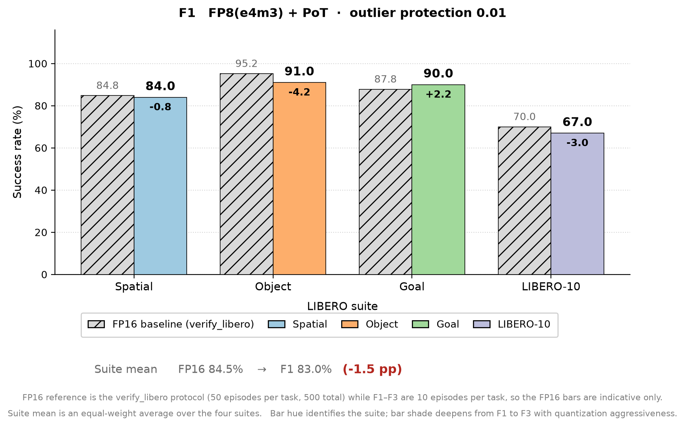
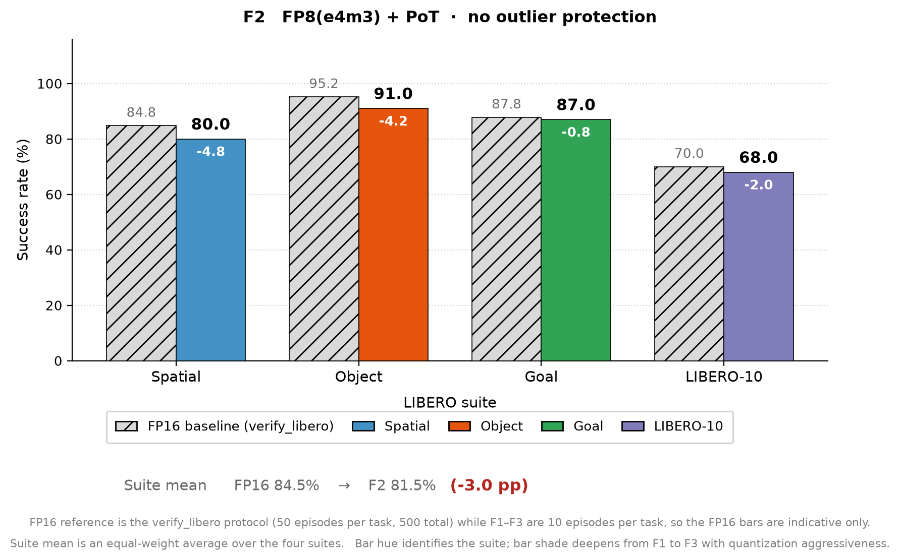
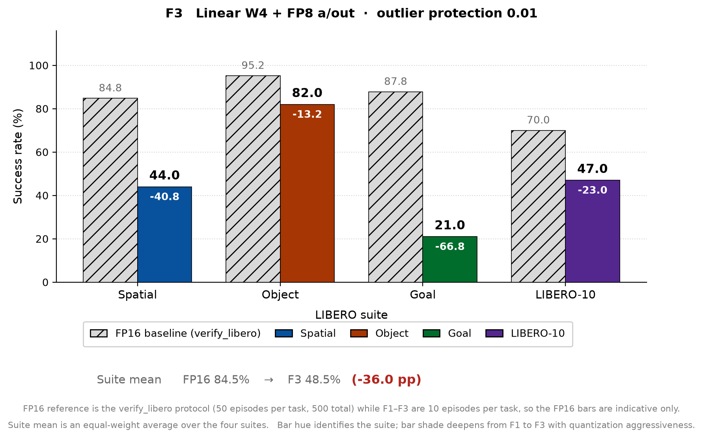
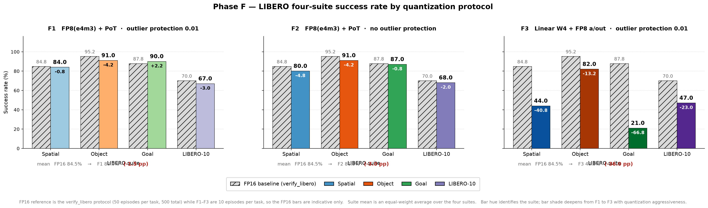

# 结果记录（Results）

> 本文档在实验**过程中与结束后**持续更新。章节为固定结构，不可删除；无内容写「无」。
> 图片放 `docs/figures/`，文中用相对路径 `` 引用。

- **实验名称**：2026-09-08_phaseF_fp8pot-foursuite
- **状态**：done（draft / running / done / aborted）
- **最后更新**：2026-09-11

---

## 1. 摘要

3 组量化协议（F1 FP8-PoT+outlier / F2 FP8-PoT 无保护 / F3 w4 权重）× LIBERO 四 suite（各 100 ep，seed 1000），共 12 次运行，9-8 01:34 启动、9-9 17:55 完成。四 suite 平均 SR：F1 **83.0%**、F2 **81.5%**、F3 **48.5%**（FP ep50 参照 84.5%）。核心发现：① outlier 保护的跨 suite 贡献仅为 +1.5pp（远小于单 suite 上的印象）；② w4 存在严重 suite 敏感性——object 仅 −9pp 但 goal 崩至 21%（−69pp）。

## 2. 总结果表

| 组 | config 前缀 | 协议 | Spatial | Object | Goal | Long(10) | 平均 | Δ vs FP 参照 |
|---|---|---|---:|---:|---:|---:|---:|---:|
| F1 | phaseF1_fp8pot_site_outlier | FP8(e4m3)+PoT, outlier 0.01 | 84.0 | 91.0 | 90.0 | 67.0 | **83.0** | −1.5 |
| F2 | phaseF2_fp8pot_site_nooutlier | FP8+PoT, 无保护 | 80.0 | 91.0 | 87.0 | 68.0 | **81.5** | −3.0 |
| F3 | phaseF3_fp8pot_w4_site_outlier | Linear w4 + FP8 a/o, outlier 0.01 | 44.0 | 82.0 | 21.0 | 47.0 | **48.5** | −36.0 |
| 参照 | verify_libero（ep50） | FP | 84.8 | 95.2 | 87.8 | 70.0 | 84.5 | — |

> 注：参照为 FP 口径（`outputs/verify_libero/*/eval_info.json`，50 ep/task = 500 total），与实验组 ep10 存在口径差；同 suite 内横向对比（F1/F2/F3 之间）不受影响。

## 3. 分组结果与分析

### 3.1 四 suite 成功率柱状图（按协议分三张）

每张图对应一个协议（F1 / F2 / F3）。**图内**四个 suite 用四种色相区分；**跨图**同一 suite 保持色相、只改变明度深浅（F1 最浅 → F3 最深，对应量化更激进）。每个 suite 左侧的浅灰斜纹柱为 FP16 参照（`verify_libero`，50 ep/task；仅示意——F1–F3 为 ep10 口径）。

配色：Spatial = 蓝、Object = 橙、Goal = 绿、LIBERO-10 = 紫。柱顶为该协议/参照的 SR(%)；柱内数字为相对 FP16 的 Δ(pp)。

**F1 — FP8(e4m3) + PoT，outlier 保护 0.01**



**F2 — FP8(e4m3) + PoT，无 outlier 保护**



**F3 — Linear W4 + FP8 a/out，outlier 保护 0.01**



三张并排版本，便于横向比较三组协议的 suite 级差异：



生成命令：

```bash
python experiments/2026-09-08_phaseF_fp8pot-foursuite/scripts/plot_phaseF_bars.py
```

> 读数提示：F3 的 Goal 柱（21.0%）与 Spatial 柱（44.0%）急剧塌陷，而 Object 仍有 82.0%，是 §3.4 所述「任务级选择性失败」的直观表现；F1/F2 四 suite 均在 80% 以上，且两者差异都在噪声带内（§3.2）。

### 3.2 F1 vs F2：outlier 保护的贡献

| suite | F1（有保护） | F2（无保护） | Δ(F1−F2) |
|---|---:|---:|---:|
| spatial | 84.0 | 80.0 | +4.0 |
| object | 91.0 | 91.0 | 0.0 |
| goal | 90.0 | 87.0 | +3.0 |
| libero_10 | 67.0 | 68.0 | −1.0 |
| 平均 | 83.0 | 81.5 | +1.5 |

分析：FP8(e4m3) 动态范围较宽时，outlier 保护的四 suite 平均贡献仅 +1.5pp，全部在 ep10 噪声带（±5.7pp）内。单 suite libero_object 上「outlier 保护使 int12 从 7%→95%」的强结论主要适用于**低 bit 整数量化**，对 FP8+PoT 并非必需。

### 3.3 F1 vs F3：w4 权重的跨 suite 代价

| suite | F1（FP8 w） | F3（w4） | Δ(F3−F1) |
|---|---:|---:|---:|
| spatial | 84.0 | 44.0 | −40.0 |
| object | 91.0 | 82.0 | −9.0 |
| goal | 90.0 | 21.0 | **−69.0** |
| libero_10 | 67.0 | 47.0 | −20.0 |
| 平均 | 83.0 | 48.5 | −36.0 |

分析：w4（含 1% outlier 元素保护的 int4 权重 + FP8 a/o）掉分高度不均：object 尚可（−9pp），goal 崩溃（21%）。逐 task 看 goal 有 6/10 任务 ≤2/10（见 §3.4），呈任务级选择性失败，提示部分任务对 expert/vlm 权重精度有硬阈值。**w4 不能作为跨 suite 通用配置**；若追求 w4 需按 suite/task 的敏感度做选择性量化或提高保护比例。

### 3.4 逐 task 成功数（/10）

| 组-suite | t0 | t1 | t2 | t3 | t4 | t5 | t6 | t7 | t8 | t9 | 合计 |
|---|---|---|---|---|---|---|---|---|---|---|---:|
| F1-spatial | 10 | 9 | 10 | 9 | 5 | 7 | 10 | 7 | 8 | 9 | 84 |
| F1-object | 9 | 10 | 9 | 9 | 10 | 7 | 10 | 8 | 9 | 10 | 91 |
| F1-goal | 10 | 10 | 9 | 8 | 10 | 9 | 7 | 9 | 10 | 8 | 90 |
| F1-libero_10 | 2 | 10 | 10 | 9 | 4 | 9 | 4 | 7 | 4 | 8 | 67 |
| F2-spatial | 10 | 8 | 9 | 9 | 6 | 5 | 10 | 6 | 8 | 9 | 80 |
| F2-object | 10 | 10 | 8 | 10 | 10 | 8 | 10 | 7 | 9 | 9 | 91 |
| F2-goal | 10 | 10 | 10 | 8 | 10 | 9 | 5 | 9 | 10 | 6 | 87 |
| F2-libero_10 | 5 | 10 | 9 | 9 | 5 | 9 | 3 | 7 | 2 | 9 | 68 |
| F3-spatial | 7 | 1 | 9 | 6 | 5 | 4 | 7 | 0 | 1 | 4 | 44 |
| F3-object | 7 | 9 | 9 | 6 | 9 | 7 | 8 | 7 | 10 | 10 | 82 |
| F3-goal | 10 | 0 | 0 | 3 | 0 | 2 | 1 | 0 | 5 | 0 | 21 |
| F3-libero_10 | 1 | 7 | 2 | 7 | 6 | 9 | 0 | 5 | 3 | 7 | 47 |

观察：F3-goal 的 t1/t2/t4/t7/t9 归零、t5 仅 2/10；F1/F2 的 libero_10 弱项（t0/t4/t6/t8）在 F3 进一步恶化。

## 4. 结论

1. **outlier 保护的贡献（F1 vs F2）**：FP8+PoT 下平均仅 +1.5pp（噪声带内），spatial 单点 +4pp 最大。此前「outlier 保护是量化可用性关键开关」的结论限定于低位宽整数（int8/int12）场景；FP8 下可选。
2. **w4 的跨 suite 代价（F1 vs F3）**：平均 −36pp 且高度不均（object −9 / goal −69），w4 在 1% outlier 元素保护下仍不可跨 suite 通用。
3. **FP8(e4m3)+PoT 全算子量化（Linear+MatMul、per_site）跨四 suite 可用**：F1 平均 83.0% vs FP 参照 84.5%，最大单 suite 差 −3pp（含 ep10/ep50 口径差），再次确证。

## 5. 问题与后续

- F1 scale reuse 未生效（三次均 recalibrate 288）——cache key 机制排查，见 setup §8；
- F3 的 suite 敏感性归因（goal 为何独崩）：候选方向——per-suite/task 权重分布差异、expert vs vlm 的 w4 敏感度分离（配合 E1 排序 `outputs/sensitivity/sensitivity.csv`）；
- 后续：w4 提高保护比例（outlier_ratio 0.05/0.1）或仅对不敏感组件 w4；纯 int8 对照待补。

## 6. 修订记录

| 日期 | 修改内容 | 修改人 |
|---|---|---|
| 2026-09-11 | 创建文档，回填 12 组结果与逐 task 明细（数据源：各 `result.json` / `eval_info.json`） | zyzhao |
| 2026-09-15 | 新增 §3.1：按协议分三张的四 suite 柱状图（`scripts/plot_phaseF_bars.py`），后续小节顺延至 §3.2–§3.4 | zyzhao |
