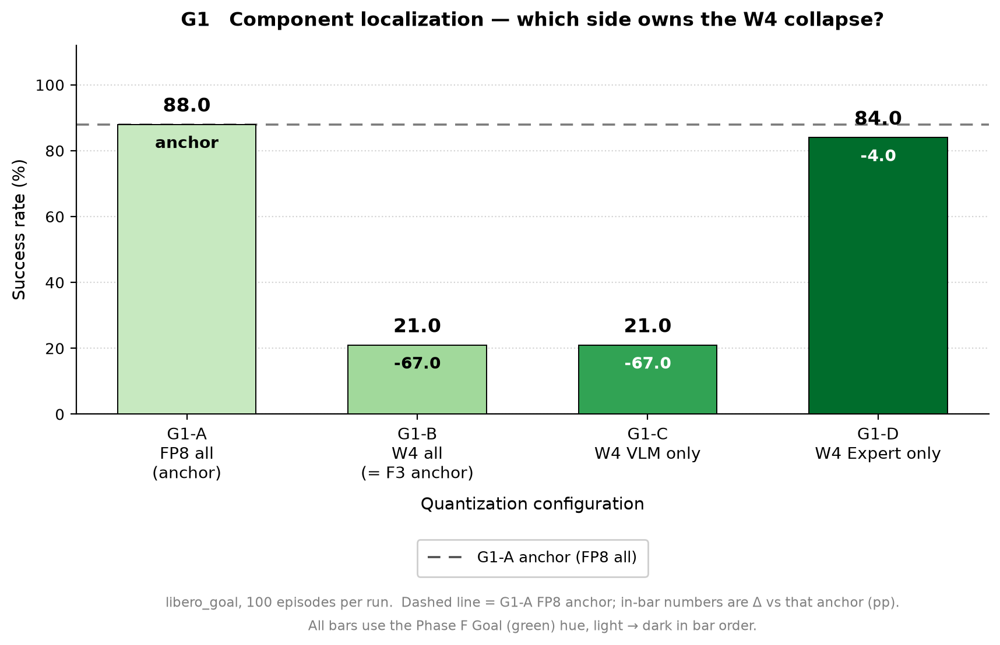

# 结果记录（Results）

> 本文档在实验**过程中与结束后**持续更新。章节为固定结构，不可删除；无内容写「无」。
> 图片放 `docs/figures/`，文中用相对路径 `` 引用。

- **实验名称**：2026-09-10_phaseG_w4-root-cause · 子实验 component-localization（G1）
- **状态**：done（draft / running / done / aborted）
- **最后更新**：2026-09-12

---

## 1. 摘要

libero_goal × 100 ep × 4 config，定位 F3 W4 退化的组件来源。核心结论：**崩溃完全来自 VLM 侧 W4**——仅量化 VLM（G1-C）= 21.0%，与全量化（G1-B）完全持平；仅量化 Expert（G1-D）= 84.0%，几乎无损（Δ −4.0pp，在 ±5.7pp 噪声带内；FP8 anchor G1-A = 88.0%）。崩溃任务集（t1/t2/t4/t7 → 0%）在 B/C 间逐 task 完全复现，D 中全部恢复。与 G0 交叉印证：VLM 权重数值误差仅 ~1.3× 于 expert，但闭环 SR 差 63pp——根因不是误差大小而是 VLM 的闭环误差敏感度，G2（tensor-wise 粒度）为最高优先级后续。

## 2. 总结果表

<!-- 每个 config 一行；数值带单位；与 baseline 的差值单独列 -->

| 组 | config | 基准 | Success Rate | Δ vs baseline | episodes | 输出目录 | 备注 |
|---|---|---|---:|---:|---:|---|---|
| G1-A | g1a_fp8_all.yaml | — | **88.0%** | — | 100 | `outputs/.../component-localization/g1a_fp8_all/` | F1 anchor 独立重跑（F1 goal 90%，Δ2pp 噪声带内） |
| G1-B | g1b_w4_all.yaml | G1-A | **21.0%** | −67.0pp | 100 | `outputs/.../component-localization/g1b_w4_all/` | F3 anchor 复现（F3 goal 21%，完全一致） |
| G1-C | g1c_w4_vlm_only.yaml | G1-A | **21.0%** | −67.0pp | 100 | `outputs/.../component-localization/g1c_w4_vlm_only/` | 仅 vlm.* W4（112 层），expert raw FP |
| G1-D | g1d_w4_expert_only.yaml | G1-A | **84.0%** | −4.0pp | 100 | `outputs/.../component-localization/g1d_w4_expert_only/` | 仅 expert.* W4（112 层），vlm raw FP |

完成时间：g1a 09-11 18:01 / g1b 09-11 21:54 / g1c 09-12 00:48 / g1d 09-12 02:56（串行，GPU hankh100）。wrap 数 preflight：A/B = 224 层，C/D = 112 层（符合 §8 预期）。

## 3. 分组结果与分析

### 3.1 task-wise Success Rate（%，libero_goal t0–t9 × 10 ep）

| task | G1-A fp8 | G1-B w4_all | G1-C w4_vlm | G1-D w4_expert | 组别 |
|---:|---:|---:|---:|---:|---|
| t0 | 100 | 100 | 100 | 100 | resistant control |
| t1 | 100 | 0 | 0 | 100 | 崩溃组 |
| t2 | 90 | 0 | 0 | 80 | 崩溃组 |
| t3 | 80 | 30 | 30 | 60 | 中间 |
| t4 | 100 | 0 | 0 | 90 | 崩溃组 |
| t5 | 90 | 20 | 0 | 90 | 中间 |
| t6 | 70 | 10 | 10 | 60 | 中间 |
| t7 | 90 | 0 | 0 | 100 | 崩溃组 |
| t8 | 100 | 50 | 50 | 100 | 中间 |
| t9 | 60 | 0 | 20 | 60 | 崩溃组（B/C 略有交换） |
| **AVG** | **88.0** | **21.0** | **21.0** | **84.0** | |

分析：

- **B ≈ C（paired task-wise）**：崩溃组 t1/t2/t4/t7 在 B、C 中均为 0%；t9 附近 B=0/C=20、t5 B=20/C=0 的交换在 10-ep 噪声内。VLM-only W4 已完整复现 F3 的任务选择性崩溃模式。
- **D 恢复几乎所有任务**：t1 100、t7 100、t4 90、t9 60（=A）、t5 90（=A）、t8 100（=A）；仅 t3（60 vs 80）、t6（60 vs 70）小幅低于 A，总体 −4.0pp 无强归因意义。
- t0 在四个 config 中全部 100%——resistant control 任务对 W4 完全不敏感，与 Phase F 观察一致。

### 3.2 组件归因（对照 §1 判读表）

> 四根柱均为 Goal 绿色系，明度由浅到深对应 A → B → C → D；其中后三档与 Phase F 的 Goal 柱同色。

| 比较 | SR | 判读 |
|---|---|---|
| C (w4_vlm) vs B (w4_all) | 21.0 vs 21.0 | VLM-only W4 ≈ F3 → 满足「VLM 主导」第一条 |
| D (w4_expert) vs A (fp8) | 84.0 vs 88.0（−4.0pp） | Expert-only W4 接近 baseline → 满足「VLM 主导」第二条 |

归因份额（粗分解）：Δ_total(B−A) = −67pp ≈ Δ_vlm(C−A) = −67pp；Δ_expert(D−A) = −4pp ≤ 噪声带 → **VLM 量化贡献 ≥ 95% 的退化**。

## 4. 结论

<!-- 对 §1「实验目的」中每个问题的直接回答；可执行的结论（保留/否决某配置） -->

1. **F3 W4 崩溃由 VLM 组件主导**（对照 §1 判读表第一行成立、第二、三、四行排除）：仅 VLM W4 即复现全部崩溃（21%），仅 Expert W4 几乎无损（84%）。
2. **与 G0 交叉印证**：G0 显示 vlm/expert 的 W4 权重 NMSE 仅 0.0128 vs 0.0097（~1.3×，数值均匀），但闭环 SR 相差 63pp——**数值误差大小无法解释闭环崩溃，VLM 对均匀 W4 噪声的闭环敏感度才是关键**（与 VLM hidden 960 > expert 720、tensor-wise scale 覆盖难度一致）。
3. **下一步优先 G2（weight-granularity）**：检验「tensor-wise W4 scale 粒度在 VLM 上是根因」；G3（action-horizon）降为次要（组件归因已干净，开环放大即使存在也是次级因素）；G4 维持 conditional。
4. 可执行建议：若 G2 per-channel/group 粒度能把 vlm-only W4 恢复到 ≥80%，则「W4 + 精细粒度」路线保留；否则 VLM 侧应维持 FP8（expert 侧 W4 无害，可单独启用）。

## 5. 问题与后续

<!-- 实验中发现的异常、失败 run、待验证问题、下一步实验（链接到新实验子目录） -->

- 校准复现性检查（§8 风险项）：G1-B = 21% 与 F3 goal 21% 完全一致；G1-A = 88% vs F1 90%（Δ2pp，噪声带内）——独立 scale_dir 重新校准通过复现性检验 ✅；
- B/C 在 t5/t9 存在 0↔20 的 task 级交换（10-ep 分辨率限制），不影响 overall 结论；
- 后续：G2 weight-granularity（`tasks/weight-granularity/`，需先实现 `weight_quant_granularity` 字段，见父实验 §5）；G3 action-horizon 视 G2 结果决定是否保留。

## 6. 修订记录

| 日期 | 修改内容 | 修改人 |
|---|---|---|
| 2026-09-11 | 创建文档 | zyzhao |
| 2026-09-12 | 回填 G1 四 config 结果（88/21/21/84）与 task-wise 明细、组件归因结论 | zyzhao |
| 2026-09-15 | 在 §3.2 插入 G1 柱状图（复用 Phase F 四 suite 调色板，引用 `../../../docs/figures/`） | zyzhao |
