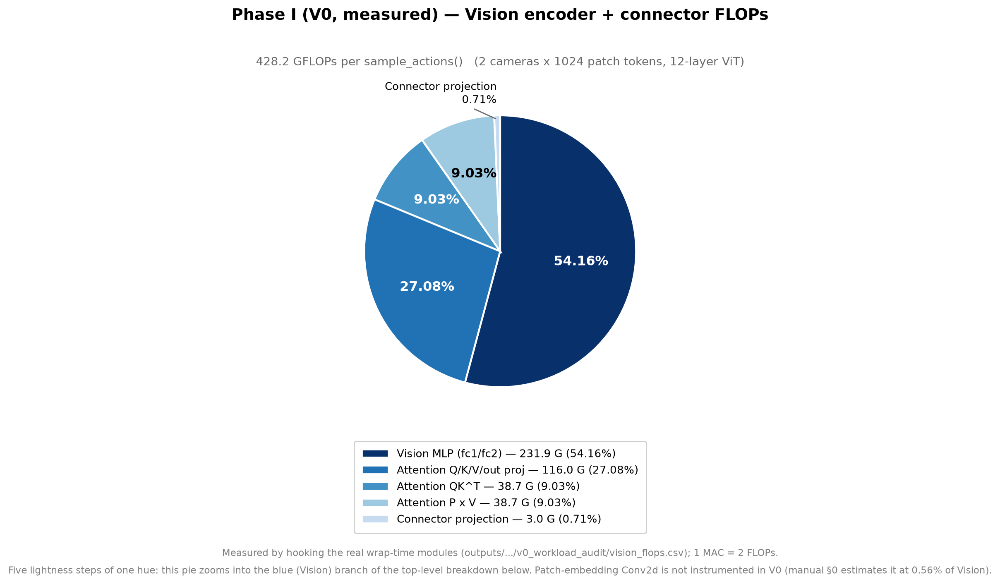
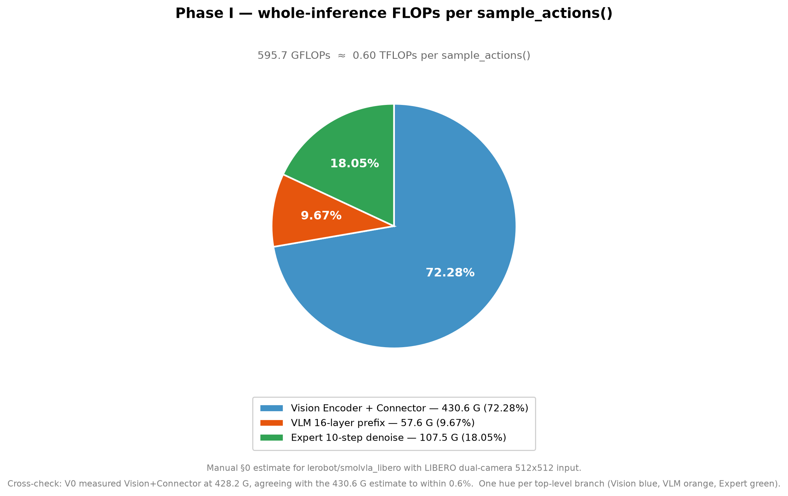
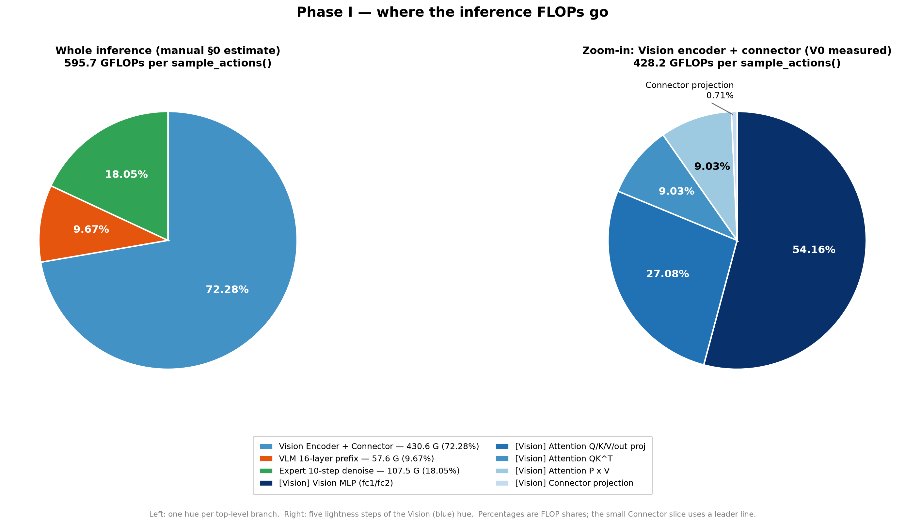

# 结果记录（Results）

> 本文档在实验**过程中与结束后**持续更新。章节为固定结构，不可删除；无内容写「无」。
> 图片放 `docs/figures/`，文中用相对路径 `` 引用。

- **实验名称**：2026-09-15_phaseI_vision-quantization
- **状态**：running（V0 ✅ / V1 ✅ / VLIN ✅ / **V2 ✅（84.0%）** / **V3 ✅（85.0%）** / V4–V5 待跑）
- **最后更新**：2026-09-22

---

## 1. 摘要

Gate L0（legacy regression）已通过：用原封不动的 G6 canonical 配置 build，确认 `QuantizedLinear=224`、`QuantizedMatMul=64`、`vision.*=0`、`connector.*=0`，Phase I 新增代码未破坏既有 VLM/Expert wrapping。V0（Vision workload audit）已完成：真实模型为 12 层 Vision Transformer（hidden=768、intermediate=3072、heads=12），attn 实现为 `sdpa`；一次 `sample_actions()` 处理 **2 张相机图**，每张图 1024 patch tokens → connector 后 64 visual tokens（12288→960）。Vision+Connector 单次 sample_actions 理论 dense FLOPs ≈ **428.2 GFLOPs**，其中 Vision MLP 54.2%、attention projection 27.1%、QK/PV 18.1%、connector 0.71%，与手册 §0 粗估（430.6 G，72%）一致。

**V1（Connector FP8）已完成（2026-09-19）**：五道 gate 全过，routing 225 Linear + 64 MatMul = **289**（224+1 connector），V1-R connector wrapper 在 raw mode 下 bit-exact（max_abs_error = 0），task0×1 smoke = 100%，Goal×100 = **81.0%（81/100）**。相对 H3 S0 89.0% 为 −8.0pp，但 **V1 对 legacy VLM/Expert scales 也进行了独立 recalibration，因此该 −8pp 只能作为参考差值，不能严格解释为 connector-only 的单变量净损失**。

**VLIN（完整 Vision 72-Linear FP8 integration）已完成（2026-09-21）**：Gate 1–6 全部通过（routing **296 Linear / 64 MatMul**，reuse 288 / recalibrate 72；coverage **72/72 sites、216/216 scale 文件**；smoke 100%），正式 Goal×100 = **80.0%（80/100）**。VLIN 严格复用 G6-A 的 288 个 legacy quant sites/scales，因此直接对照为 **G6-A 90.0% → VLIN 80.0%，Δ = −10.0pp**。72 个 Vision Linear 覆盖 347.9 GFLOPs（≈81.2% Vision compute / 58% 整体推理），Vision QK/PV 保持原 SDPA、connector 保持 raw。相对 G6-A 的逐 task 变化为 **[0, 0, −1, −1, −1, 0, −3, 0, −1, −3]**，损失主要集中在 task06 / task09。

## 2. 总结果表

| 组 | config | 基准 | Success Rate | Δ vs baseline | episodes | 输出目录 | 备注 |
|---|---|---|---|---|---|---|---|
| Gate L0 | g6a_all_fp8_control（复用） | — | — | — | — | — | 224 Linear / 64 MatMul / 0 vision / 0 connector |
| V0 | v0_workload_audit | — | 100.0%（task0） | — | 1 | `outputs/.../v0_workload_audit` | 无量化，仅 workload/FLOPs 审计 |
| V1-R | v1_connector_fp8（raw mode） | 原模型 connector | **bit-exact** | 0.0 | — | — | max/mean/max_rel error 全为 `0.000e+00` |
| V1 smoke | v1_connector_fp8 | — | 100.0%（task0） | — | 1 | `outputs/.../v1_connector_fp8` | 289 quant modules（225 Linear + 64 MatMul） |
| **V1** | v1_connector_fp8_goal | H3 S0 = 89.0%（**参考，非严格单变量基线**） | **81.0%（81/100）** | −8.0 pp（参考） | 100 | `outputs/.../v1_connector_fp8_goal` | legacy VLM/Expert scales 也重新 calibration；Wilson 95% CI `[72.2%, 87.5%]` |
| VLIN Gate1–5 | vlin_full_vision_linear_fp8（gate 部分） | — | — | — | — | `scales/.../vlin_full_vision_linear_fp8` | routing 296 Linear / 64 MatMul；reuse 288 / recalibrate 72；72/72 sites、216/216 scale 文件 |
| VLIN smoke | vlin_full_vision_linear_fp8 | — | 100.0%（task0） | — | 1 | `outputs/.../vlin_full_vision_linear_fp8` | 360 quant modules（296 Linear + 64 MatMul）；eval_s ≈ 94.2 |
| **VLIN Goal×100** | vlin_full_vision_linear_fp8_goal | **G6-A = 90.0%** | **80.0%（80/100）** | **−10.0 pp** | 100 | `outputs/.../vlin_full_vision_linear_fp8_goal` | Wilson 95% CI `[71.1%, 86.7%]`，eval_s = 10189（≈2.83h）；对 H3 S0（89.0%）为 −9.0pp |
| V2 Gate1–5 | v2_vision_mlp_fp8（gate 部分） | — | — | — | — | `scales/.../v2_vision_mlp_fp8` | routing **248 Linear / 64 MatMul**；reuse 288 / recalibrate 24；24/24 sites、72 scale 文件 |
| V2 smoke | v2_vision_mlp_fp8 | — | 100.0%（task0） | — | 1 | `outputs/.../v2_vision_mlp_fp8` | 312 quant modules；eval_s ≈ 103.5 |
| **V2 Goal×100** | v2_vision_mlp_fp8_goal | **G6-A = 90.0%** | **84.0%（84/100）** | **−6.0 pp（L_MLP）** | 100 | `outputs/.../v2_vision_mlp_fp8_goal` | eval_s = 8013；逐 task [10,10,10,6,9,10,4,9,10,6] |
| V3 Gate1–5 | v3_vision_attn_proj_fp8（gate 部分） | — | — | — | — | `scales/.../v3_vision_attn_proj_fp8` | routing **272 Linear / 64 MatMul**；reuse 288 / recalibrate 48；48/48 sites、144 scale 文件 |
| V3 smoke | v3_vision_attn_proj_fp8 | — | 100.0%（task0） | — | 1 | `outputs/.../v3_vision_attn_proj_fp8` | 336 quant modules；Gate1–6 全过 |
| **V3 Goal×100** | v3_vision_attn_proj_fp8_goal | **G6-A = 90.0%** | **85.0%（85/100）** | **−5.0 pp（L_Attn）** | 100 | `outputs/.../v3_vision_attn_proj_fp8_goal` | 逐 task [10,9,10,8,9,9,4,9,10,7] |

## 3. 分组结果与分析

### 3.1 Gate L0 — legacy regression

| 项 | 期望 | 实测 | 判定 |
|---|---:|---:|---|
| QuantizedLinear | 224 | 224 | ✅ |
| QuantizedMatMul | 64 | 64 | ✅ |
| vision.* module | 0 | 0 | ✅ |
| connector.* module | 0 | 0 | ✅ |

### 3.2 V0 — Vision 结构 / 运行时 / FLOPs

静态结构（`vision_structure.json`）：

| 项 | 值 |
|---|---|
| Vision 层数 | 12 |
| hidden / intermediate | 768 / 3072 |
| heads | 12 |
| image_size / patch_size | 512 / 16（→ 1024 patch tokens） |
| attention impl | **sdpa**（⚠ 非 eager，V4 需先做 eager-equivalence gate） |
| connector | scale_factor=4，proj 12288→960（→ 64 tokens） |

运行时（`vision_runtime_shapes.json`）：

| 项 | 值 |
|---|---|
| cameras / sample_actions | **2.0**（真实 inference 实测：19 次 sample_actions × 2 = 38 vision calls） |
| vision 输出 shape | [1, 1024, 768] |
| connector 输出 shape | [1, 64, 960] |

FLOPs（`vision_flops.csv`，1 MAC = 2 FLOPs，per sample_actions）：

| operator | FLOPs | % of vision |
|---|---:|---:|
| Vision MLP (fc1/fc2) | 2.319e11 | 54.16% |
| Attention projection (q/k/v/out) | 1.160e11 | 27.08% |
| QK | 3.865e10 | 9.03% |
| PV | 3.865e10 | 9.03% |
| Connector proj | 3.020e09 | 0.71% |
| **合计** | **4.282e11** | 100% |

分析：Vision MLP 是 Vision 内部最大算力块（54%），其次 attention projection（27%）、QK/PV（18%）。与手册 §0 粗估一致，验证了「只补 Vision MLP + attention projection 即可覆盖约 80% Vision compute」的判断。

### 3.3 FLOPs 占比（饼图）

**Phase I 实测（V0）— Vision encoder + connector 内部拆分**（428.2 GFLOPs / `sample_actions()`）



| 子模块 | GFLOPs | Vision 内占比 |
|---|---:|---:|
| Vision MLP `fc1/fc2` | 231.93 | 54.16% |
| Attention Q/K/V/out projection | 115.96 | 27.08% |
| Attention `QK^T` | 38.65 | 9.03% |
| Attention `P×V` | 38.65 | 9.03% |
| Connector projection | 3.02 | 0.71% |
| **合计** | **428.22** | **100%** |

**整体推理 — 单次 `sample_actions()`**（手册 §0 粗估，595.7 GFLOPs ≈ 0.60 TFLOPs）



| 组件 | GFLOPs | 占比 |
|---|---:|---:|
| Vision Encoder + pixel shuffle / connector | 430.60 | 72.28% |
| VLM 16-layer prefix prefill | 57.60 | 9.67% |
| Action Expert 10-step denoise | 107.50 | 18.05% |
| **总计** | **595.70** | **100%** |

两图并排（便于看出左图的蓝色扇区就是右图的放大）：



**配色说明**：整体图给每个顶层分支一个色相（Vision 蓝 / VLM 橙 / Expert 绿）；Vision 内部图是对蓝色分支的放大，因此用**同一蓝色的 5 档明度**，按占比由大到小由深到浅。两份图共用 `scripts/figure_palette.py`，与 Phase F/G 图同源。

**交叉验证**：手册 §0 粗估 Vision+Connector 为 430.6 G，V0 实测为 428.2 G，两者相差 **0.6%**，互相印证。

生成命令（数值均从源文件解析，不硬编码；整体图的数字直接解析手册 §0 表格）：

```bash
python experiments/2026-09-15_phaseI_vision-quantization/scripts/plot_phaseI_flops_pies.py
```

### 3.4 V1-R — Connector raw wrapper 等价性

方法（`scripts/v1_connector_raw_equiv.py`）：用**同一份 config** build 两个模型，仅切换 `quantization.connector.enabled`；开启侧把全部 module 切到 `raw` 模式（不做 fake quant），喂入同一 vision-hidden 张量，比较 connector 输出。

```
original connector proj type: Linear
wrapped  connector proj type: QuantizedLinear
============================================================
V1-R connector raw equivalence
============================================================
max_abs_error  : 0.000e+00
mean_abs_error : 0.000e+00
max_rel_error  : 0.000e+00
V1-R: PASS (raw wrapper exact)
```

| 项 | 期望（手册 §9.2） | 实测 | 判定 |
|---|---|---|---|
| connector proj 被 wrap | `QuantizedLinear` | `QuantizedLinear` | ✅ |
| max_abs_error | exact 或 dtype rounding 级 | **0.000e+00** | ✅ |
| mean_abs_error | 同上 | **0.000e+00** | ✅ |
| max_rel_error | 同上 | **0.000e+00** | ✅ |
| 总 quantized modules | 225 Linear + 64 MatMul = 289 | **289** | ✅（手册 §7） |

> **方法学意义**：raw wrapper 的 bit-exact 排除了「wrapper 本身改变 connector 数值」这一类混淆项。
> **范围限制**：它**不能单独证明 V1 的 8pp 变化全部来自 connector 量化**，因为 V1 运行还对 legacy VLM/Expert scales 做了独立 recalibration；此外当前脚本只覆盖 connector output，未覆盖 prefix embedding / final action chunk。

### 3.5 V1 — Connector FP8（Goal × 100）

配置：canonical VLM/Expert FP8 背景 + `connector.overrides[connector_fp8] = pot_fp8_outlier`（A/W/O 全 `e4m3`），`linear.include = [vlm.*, expert.*, connector.*]`，`vision.enabled = false`。calibration：`episodes=8 / batch_size=8 / frame_stride=4`（recalibrate，connector scale 首次生成）。

**Gate 结果**

| Gate | 要求 | 实测 | 判定 |
|---|---|---|---|
| Gate 1 routing count | 225 Linear | 225 Linear + 64 MatMul = 289 | ✅ |
| Gate 2 raw equivalence | exact | `0.000e+00`（§3.4） | ✅ |
| Gate 3 calibration-only | scale 文件生成 | `scales/.../v1_connector_fp8` | ✅ |
| Gate 4 task0 × 1 smoke | SR | **100.0%（1/1）** | ✅ |
| Gate 5 Goal × 100 | SR | **81.0%（81/100）** | ✅（完成，但显著下降） |

**逐 task 成功数（每 task 10 episodes，与 Phase H H3 S0 FP8-all 同 task 对照）**

| Config | t00 | t01 | t02 | t03 | t04 | t05 | t06 | t07 | t08 | t09 | 合计 |
|---|---:|---:|---:|---:|---:|---:|---:|---:|---:|---:|---:|
| H3 S0 FP8-all（baseline） | 10 | 10 | 10 | 8 | 10 | 9 | 5 | 9 | 10 | 8 | **89** |
| **V1 Connector FP8** | 10 | 10 | **8** | **7** | 10 | 9 | **3** | 9 | **9** | **6** | **81** |
| Δ | 0 | 0 | **−2** | **−1** | 0 | 0 | **−2** | 0 | **−1** | **−2** | **−8** |

统计：SR = 81.0%（81/100），Wilson 95% CI **[72.2%, 87.5%]**。相对 H3 S0 89.0% 的表观差值为 **−8.0pp**；由于两者并非完全相同的 scale background，该差值主要作为现象参考，不用于严格 connector-only 归因。

**要点**

- **降幅不均匀**：task00 / 01 / 04 / 05 / 07 **完全不降**；损失集中在 task02（−2）、task03（−1）、**task06（−2）**、task08（−1）、**task09（−2）**。即 **connector 量化打掉的是「困难 task 上的余量」**，而非均匀削弱所有能力。task06 在 baseline 下本已最弱（5/10），V1 下进一步降到 3/10。
- **单位 FLOPs 的代价极高**：connector 仅占 0.71% 的 Vision+Connector FLOPs（占整体推理约 0.51%），却带来 8pp 损失。对照 Phase G：VLM **全部 attention** W4 = −18pp、VLM **全部 MLP** W4 = −51pp。connector 只有 1 个 Linear，却拿到 attention 全部（16 层 × 4 投影 = 64 个 Linear）损失的 **44%**。
- **可能原因（待验）**：① connector 输出直接构成 VLM 的 64 个 visual token，**无中间归一化缓冲**，单点量化误差直接进入 prefix；② 12288→960 的投影需要保留 pixel-shuffle 通道的精细混合结构，per-tensor/per-site 的 scale 难以同时容纳全部通道的动态范围；③ `outlier_ratio=0.01` 对 connector 的输入分布未必合适。
- **不影响 V2 的正确性，但影响优先级**：按手册 §9.4，V1 出现明显下降时**应先审计再进 V2**（见 §5）。

### 3.6 VLIN — 完整 Vision 72-Linear FP8 integration（Gate 1–6）

背景：当前工作分支 `phaseI/vision-linear-full-integration` 基于 `main@2b2a3013`，补全 Vision Encoder **全部 72 个 Linear** 的 FP8 wrapping。实验设计：VLM + Expert = 224 Linear + 64 MatMul（FP8，**复用 G6-A canonical scale，reuse**）；Vision Encoder = 72 Linear（FP8，**重新 calibration**）；QK/PV 保持原 SDPA 不量化；**connector 保持 raw**（与 V1 显式区分，故总数为 296 而非 297）。

一键脚本 `scripts/run_full_vision_linear.sh`（fail-loud，任一 Gate 失败即退出）于 2026-09-21 在本机跑通，总耗时 ≈ 25 min（calibration 45/45 forwards ≈ 8–10 min）。

**Gate 结果**

| Gate | 内容 | 实测 | 判定 |
|---|---|---|---|
| 1 | py_compile + `tests/test_vision_quant_routing.py` | 全过（含新增「72/72 全部 recalibrate」用例） | ✅ |
| 2 | G6-A canonical scale 复制 | 复制到 `scales/2026-09-15_phaseI_vision-quantization/vlin_full_vision_linear_fp8`（独立目录，不触碰 G6 原始 scale） | ✅ |
| 3 | routing/count 审计（真实模型） | 见下表 | ✅ |
| 4 | calibration-only | 45/45 forwards，仅重校准 72 个 Vision Linear | ✅ |
| 5 | calibration coverage | 见下 | ✅ |
| 6 | Goal task0 × 1 smoke | **SR = 100.0%（1/1）**，eval_s ≈ 94.2 | ✅ |

Gate 3 routing 明细（`scripts/audit_full_vision_linear_routing.py`）：

| 项 | 实测 | 判定 |
|---|---:|---|
| QuantizedLinear 总数 | **296** | ✅ |
| VLM/Expert Linear（reuse） | 224 | ✅ |
| Vision Linear（recalibrate） | **72**（attn proj 48 + MLP 24） | ✅ |
| Connector Linear | 0 | ✅ |
| QuantizedMatMul 总数 | 64（Vision 0） | ✅ |
| calibration action | **reuse 288 / recalibrate 72**（288 = 224 Linear + 64 MatMul） | ✅ |
| Vision op（q/k/v/out_proj/fc1/fc2） | 各 **12/12** | ✅ |
| module_id / scale group | 无重复 | ✅ |
| A/W/O dtype | 全 E4M3，method = `pot_fp8_outlier` | ✅ |

Gate 5 coverage 明细（`scripts/audit_full_vision_linear_calibration.py`，逐文件打开 pickle 校验）：

| 项 | 实测 |
|---|---:|
| Vision Linear sites | **72 / 72** |
| complete sites（A/W/O 齐 + finite + >0） | **72 / 72** |
| Vision scale 文件 | **216 / 216**（72 × 3：A/W/O） |
| scale 目录总文件 | 1080 = canonical 复制 864 + 新增 216 |

**Goal×100 正式结果（2026-09-21，`run_full_vision_linear_goal.sh`，seed=1000，n_action_steps=10）**：**SR = 80.0%（80/100）**，Wilson 95% CI `[71.1%, 86.7%]`，eval_s = 10189（≈2.83h，101.9 s/ep）。

逐 task（**严格对照 G6-A**；V1 仅列作视觉路径现象参考）：

| Config | t00 | t01 | t02 | t03 | t04 | t05 | t06 | t07 | t08 | t09 | 合计 |
|---|---:|---:|---:|---:|---:|---:|---:|---:|---:|---:|---:|
| **G6-A strict baseline** | 10 | 10 | 9 | 8 | 10 | 9 | 7 | 9 | 10 | 8 | **90** |
| **VLIN Vision 72-Linear FP8** | 10 | 10 | 8 | 7 | 9 | 9 | 4 | 9 | 9 | 5 | **80** |
| **Δ(VLIN−G6-A)** | 0 | 0 | **−1** | **−1** | **−1** | 0 | **−3** | 0 | **−1** | **−3** | **−10** |
| V1 Connector FP8（参考） | 10 | 10 | 8 | 7 | 10 | 9 | 3 | 9 | 9 | 6 | **81** |

**要点**

- **严格净差值：Δ vs G6-A = −10.0pp（90→80）**。VLIN 复用与 G6-A 完全相同的 288 个 legacy quant sites/scales，仅新增 Vision 72 Linear FP8，因此该差值可作为本次 Vision-Linear 量化的主要闭环结果。
- **损失集中而非均匀**：task06 / task09 各 −3，共贡献 6/10 个新增失败；task02 / 03 / 04 / 08 各 −1；task00 / 01 / 05 / 07 不变。
- **V1 与 VLIN 的 task pattern 相似是待验证线索，而不是已证实机制**。两者都在 t02/03/06/09 较弱，提示 visual representation → connector → VLM prefix 可能存在共同敏感通道；但 V1 的 legacy scales 独立 recalibrate，当前证据不足以把两者当成两个严格单变量数据点。
- **运行时间不等于硬件 speedup**：VLIN `eval_s=10189`，严格基线 G6-A `eval_s=7430`；当前框架是 fake/simulated quantization，且失败 episode 更容易跑满 300 steps，外加 GPU 争用与 outlier side path 开销，因此 `eval_s` 仅记录 rollout 成本，不能用于证明 FP8 硬件加速。
- **框架能力验证**：现有框架无需改 `model_wrapper.py` 即可完整 wrap 72 个 Vision Linear，routing / per-site scale group / 分层 calibration policy（reuse vs recalibrate）全部按预期工作。
- V0 已测得这 72 个 Linear 覆盖 Vision 内部 **81.2% FLOPs**（MLP 54.2% + attention projection 27.1%），约占 whole inference **58% dense FLOPs**。80% 的闭环结果说明这部分值得继续做 sensitivity 拆分，而不是直接继续扩大到 QK/PV。

### 3.7 V2 — Vision MLP-only FP8（Goal × 100，2026-09-21）

按 §5.1 归因设计的第一组单变量消融：Vision MLP `fc1/fc2` 24 个 Linear FP8（G6-A 288 sites 全 reuse，Vision attn proj / QK·PV / connector raw）。routing 248 Linear / 64 MatMul、reuse 288 / recalibrate 24、coverage 24/24（72 scale 文件）、smoke task0×1 = 100%（Gate 1–6 全过，runner `run_vision_linear_variant.sh`）。

**Goal×100 = 84.0%（84/100）**，eval_s = 8013。逐 task（严格对照 G6-A）：

| Config | t00 | t01 | t02 | t03 | t04 | t05 | t06 | t07 | t08 | t09 | 合计 |
|---|---:|---:|---:|---:|---:|---:|---:|---:|---:|---:|---:|
| **G6-A strict baseline** | 10 | 10 | 9 | 8 | 10 | 9 | 7 | 9 | 10 | 8 | **90** |
| **V2 MLP-only** | 10 | 10 | **10** | **6** | 9 | **10** | **4** | 9 | 10 | **6** | **84** |
| **Δ(V2−G6-A)** | 0 | 0 | **+1** | **−2** | −1 | **+1** | **−3** | 0 | 0 | **−2** | **−6** |
| VLIN（MLP+attn） | 10 | 10 | 8 | 7 | 9 | 9 | 4 | 9 | 9 | 5 | **80** |

**要点**

- **L_MLP = 90 − 84 = 6pp**（占 L_all = 10pp 的 60%）。V2 只覆盖 24 个 Linear（54.2% Vision FLOPs），却已贡献全量损失的 6 成。
- 损失集中在 **t03（−2）、t06（−3）、t09（−2）**；**t06/t09 与 VLIN 的重灾 task 完全一致**（各 −3），t02/t05 的 +1 在 1-ep 噪声范围内。
- 待 V3 完成后计算 interaction = L_all − (L_MLP + L_Attn) = 10 − (6 + L_Attn)。若 V3 较高（L_Attn 小）则 interaction 显著为负，说明 MLP 与 attn proj 的量化误差在闭环上存在耦合（联合时互相放大）。

### 3.8 V3 — Vision AttnProj-only FP8（Goal × 100，✅ 完成 2026-09-22）

按 §5.1 归因设计的第二组单变量消融：Vision `q/k/v/out_proj` 48 个 Linear FP8（G6-A 288 sites 全 reuse，Vision MLP / QK·PV / connector raw）。Gate 1–6 全过：routing **272 Linear / 64 MatMul**、reuse 288 / recalibrate 48、coverage 48/48（144 scale 文件）、smoke task0×1 = 100%（runner `run_vision_linear_variant.sh`）。

**Goal×100 = 85.0%（85/100）**，eval_s = 18241（20:0x–00:5x，≈5.1h；失败 episode 跑满 300 步拉长耗时）。逐 task（严格对照 G6-A）：

| Config | t00 | t01 | t02 | t03 | t04 | t05 | t06 | t07 | t08 | t09 | 合计 |
|---|---:|---:|---:|---:|---:|---:|---:|---:|---:|---:|---:|
| **G6-A strict baseline** | 10 | 10 | 9 | 8 | 10 | 9 | 7 | 9 | 10 | 8 | **90** |
| **V3 AttnProj-only** | 10 | 9 | 10 | 8 | 9 | 9 | **4** | 9 | 10 | **7** | **85** |
| **Δ(V3−G6-A)** | 0 | −1 | +1 | 0 | −1 | 0 | **−3** | 0 | 0 | −1 | **−5** |
| V2 MLP-only | 10 | 10 | 10 | 6 | 9 | 10 | 4 | 9 | 10 | 6 | **84** |
| VLIN（MLP+attn） | 10 | 10 | 8 | 7 | 9 | 9 | 4 | 9 | 9 | 5 | **80** |

### 3.9 §5.1 归因汇总（V2/V3 完成，2026-09-22）

$$
L_{\rm MLP} = 90-84 = 6\text{pp},\quad L_{\rm Attn} = 90-85 = 5\text{pp},\quad L_{\rm all} = 90-80 = 10\text{pp}
$$

$$
\text{interaction} = L_{\rm all} - (L_{\rm MLP}+L_{\rm Attn}) = 10 - 11 = \boxed{-1\text{pp}}
$$

**结论**：interaction = −1pp ≈ 0（100-ep 分辨率下每个 task 1 成功 = 1pp 噪声量级）⇒ **MLP 与 attn projection 的量化损失近似可加**，无显著超/次可加耦合。VLIN 的 10pp 可分解为 MLP 主导（6pp）+ attn proj（5pp），重叠仅 1pp。

**逐 task 交叉验证**：三种变体在 **t06 上同为最大损失点（各 −3，7→4）**；t09 在 V2（−2）与 VLIN（−3）上受损但在 V3 上仅 −1，说明 t09 更偏 MLP 敏感；t03 仅 V2 受损（−2）而 V3 打平，同样偏 MLP 敏感。t06 是 Vision 量化全局最敏感 task，值得单独审计（该 task 在 G6-A baseline 下本就最弱 7/10）。

**归因后启示**：Vision MLP（24 Linear，54.2% Vision FLOPs）与 attn proj（48 Linear，27.1%）单位 FLOPs 代价相当（6pp vs 5pp），不存在「某一家族可安全量化、另一家不可」的格局；若要降低 10pp 总代价，需从量化方法（如 per-channel scale / 更低 outlier ratio / W8A8 折中）而非 site 选择入手，或接受 Vision 侧保留更高精度。

## 4. 结论

1. **Phase I 新增代码向后兼容**（Gate L0 PASS，224/64/0/0；开启 connector 后为 225 Linear + 64 MatMul = 289，与手册 §7 的预期 count 表一致）。
2. **Vision+Connector 占单次 `sample_actions()` 的 dense FLOPs 约 428 G**（占全推理 ~72%），**Vision MLP 是最大块（54.2%）**，attention projection 27.1%、QK/PV 18.1%、connector 仅 0.71% ⇒ 手册「只补 Vision MLP + attention projection 即可覆盖 ~80% Vision compute」的判断成立。
3. **Connector 的 raw wrapper 是 bit-exact 的**（V1-R：max/mean/max_rel error 全为 `0.000e+00`），因此可排除 wrapper 本身引入数值偏差；但 V1 还包含 legacy VLM/Expert scales 的独立 recalibration，故不能把 89→81 的全部差值严格归因于 connector 单点量化。
4. **V1 显示 connector 路径值得重点审计**：connector 仅占 0.71% Vision+Connector FLOPs，而 V1 的 Goal×100 为 81.0%。由于 V1 不是严格 connector-only 单变量，该结果应表述为「connector / visual-prefix 路径存在敏感信号」，后续需用统一 G6-A scale background 的消融再做因果归因。
5. **attention 实现为 `sdpa`（非 eager）**，V4（QK/PV 量化）前必须先做 eager-backend equivalence gate（手册 §12.2）；否则 QK/PV 的量化无法与既有统计口径对齐。
6. **逐 task 视角**：V1 与 H3-S0 同 task 对比，降幅集中在 task02（10→8）、task03（8→7）、**task06（5→3）**、task08（10→9）、**task09（8→6）**；而 **task00/01/04/05/07 完全不降** ⇒ connector 量化**不是均匀地削弱能力，而是打掉了模型在困难 task 上的余量**（task06 本就是 S0 最弱的 task）。这与 §1 的 8pp 均值一致，但解释了「为何均值降 8pp 而很多 task 看不出变化」。
7. **完整 Vision 72-Linear FP8（VLIN）已完成（2026-09-21）**：工程链路全过（routing 296/64、reuse 288 / recalibrate 72、72/72 + 216/216、smoke 100%），**Goal×100 = 80.0%（80/100，Δ = −10.0pp vs G6-A 90%）**，CI `[71.1%, 86.7%]`。58% 推理计算量入 FP8 的代价为 10pp，高于预期。
8. **V1 与 VLIN 的逐 task 模式相似仅作为机制假设**：两者都在 t02/03/06/09 较弱，提示 visual token / VLM prefix 可能是共同敏感路径；但现有结果不足以证明同一误差传导机制。后续应在统一 scale background 下比较 connector output / prefix embedding / action chunk 扰动。

## 5. 问题与后续

- **Vision sparsity-compute 审计**：VSC-0 的 native sparsity 结果有效，但旧 `workload.csv` 对 MatMul 使用被 A/B/O 覆盖的 role-agnostic shape，故首轮 688.50 GFLOPs / 88.3% coverage 作废。core 已修复为 `MACs = O.numel() × A.shape[-1]`，VSC-1 同条件 rerun pending。
- **V2/V3 归因已完成**：V2=84%（L_MLP=6pp）、V3=85%（L_Attn=5pp）、VLIN=80%（L_all=10pp），`interaction=-1pp≈0`，说明 Vision MLP 与 attention projection 的 FP8 损失在当前 100-ep 分辨率下近似可加。当前没有证据支持只保护某一类 Vision Linear 就能完全消除精度代价。
- **下一优先级改为加入 Vision 后的 workload characterization**：已按规范新增 `tasks/vision-sparsity-compute/`，完整设计只写在该 task 的 `docs/experiment_setup.md`。Primary 统计 Vision/VLM/Expert 的 native element/bit sparsity、static weight sparsity，以及 per-`sample_actions()` MAC/FLOP 与 quantized major-op coverage。
- **V4 QK/PV 暂缓**：先完成 sparsity / compute 画像，再决定是否值得为 SDPA→eager equivalence 与 Vision QK/PV 量化投入额外工程工作。
- **V1 结果保留但降级为参考证据**：其 raw wrapper bit-exact 结论有效；89→81 的 8pp 因 legacy scales 也重新 calibration，不再写成严格 connector-only 净损失。
- **性能评估与精度评估分离**：`eval_s` 不作为 FP8 speedup 证据；真实加速需后续在实际低精度 kernel / 硬件执行路径下单独测量。

## 6. 修订记录

| 日期 | 修改内容 | 修改人 |
|---|---|---|
| 2026-09-15 | 创建文档 | |
| 2026-09-15 | 回填 Gate L0 + V0（结构/运行时/FLOPs）结果 | |
| 2026-09-15 | 新增 §3.3 FLOPs 占比饼图（V0 实测 + 手册 §0 整体推理） | |
| 2026-09-19 | 回填 **V1（Connector FP8）**：V1-R raw 等价性 bit-exact、smoke 100%、**Goal×100 = 81.0%（−8.0pp vs H3 S0 89.0%）**；新增 §3.4/§3.5、重写 §4 结论 6 条与 §5 后续；状态保留 `running`（V2–V5 待跑） | |
| 2026-09-21 | 回填 **VLIN（完整 Vision 72-Linear FP8）Gate 1–6**：routing 296/64、reuse 288 / recalibrate 72、coverage 72/72 + 216/216、smoke 100%；新增 §3.6、总结果表 3 行、结论第 7 条、§5 首条（Goal×100 待跑） | |
| 2026-09-21 | 回填 **VLIN Goal×100 = 80.0%（80/100，Δ −10.0pp vs G6-A）**；新增逐 task 对照；状态改为 `VLIN ✅` | |
| 2026-09-21 | 审计修订：VLIN 改为严格对照 G6-A 逐 task Δ；V1 标记为非严格单变量参考；删除 fake-quant `eval_s` 的 speedup 推断；“共同传导通道”降级为待验证假设；后续实验设计统一指向 `experiment_setup.md §5.1` | |
| 2026-09-21 | 实现 §5.1 归因设计：V2/V3 config（4 个）+ 审计脚本参数化 + 泛化 runner；修复 goal config 缩进；**回填 V2 Goal×100 = 84.0%（L_MLP = 6pp）**，新增 §3.7 | |
| 2026-09-22 | 回填 **V3 部分结果**（§3.8）：Gate1–6 全过（272/64、48/48、144 文件、smoke 100%）；Goal×100 t0–t6 完成，59/70（t06 = 4/10 为共同重灾）；最终版待 result.json | |
| 2026-09-22 | 回填 **V3 最终结果（§3.8 定稿 + §3.9 归因汇总）**：**V3 = 85.0%（85/100）**；L_MLP=6pp / L_Attn=5pp / L_all=10pp，**interaction = −1pp ≈ 0（近似可加）**；t06 为三变体共同最大损失点（各 −3） | |
| 2026-09-22 | 审计 V2/V3 回填并补齐总表；创建标准子实验 `tasks/vision-sparsity-compute/`，下一阶段转向 Vision/VLM/Expert sparsity + compute workload characterization | |
