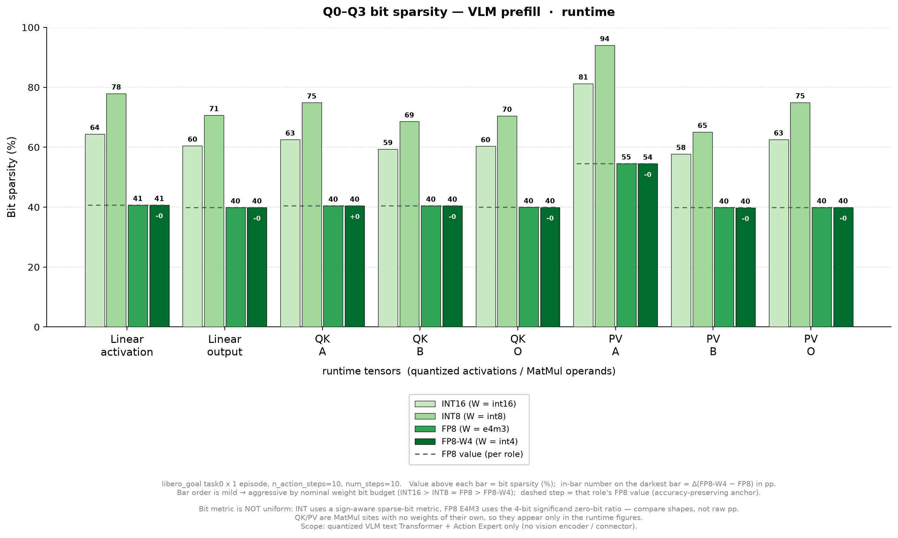
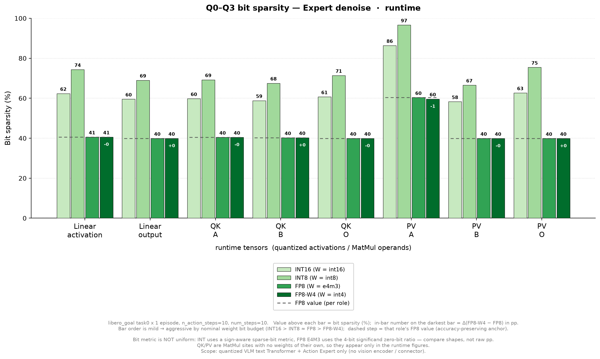
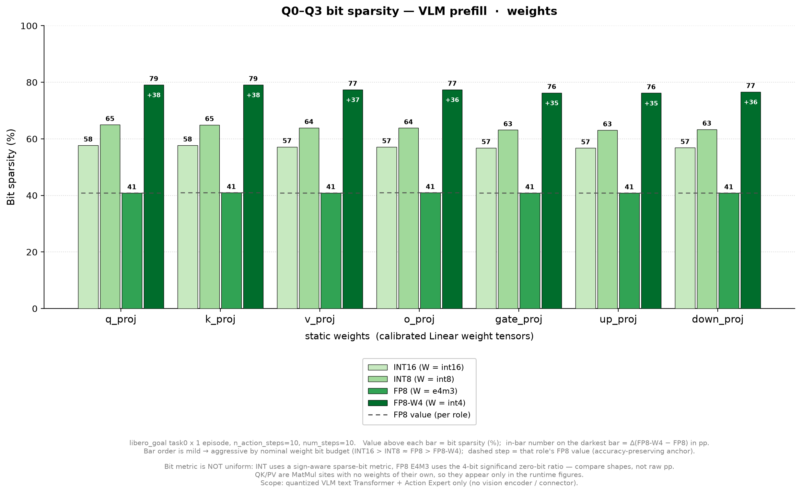
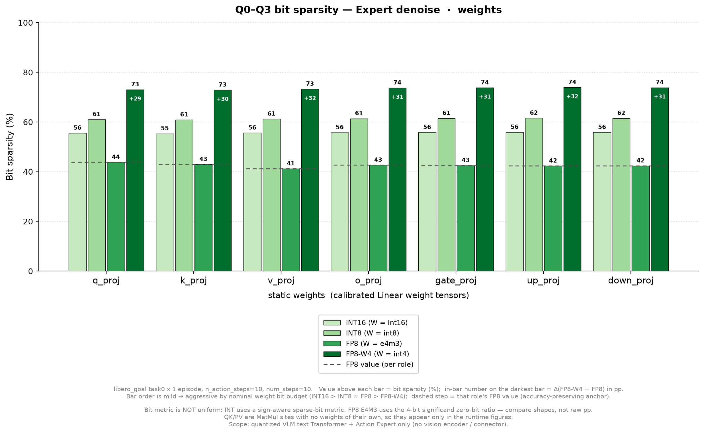

# 结果记录（Results）

> 本文档在实验**过程中与结束后**持续更新。章节为固定结构，不可删除；无内容写「无」。
> 图片放 `docs/figures/`，文中用相对路径 `` 引用。

- **实验名称**：2026-09-15_sparsity-ratio-quickscan
- **状态**：done（draft / running / done / aborted）
- **最后更新**：2026-09-19

---

## 1. 摘要

本实验用 4 组量化配置（INT8 / INT16 / FP8(A/O)-W4+PoT(A/O) / FP8 PoT）在 `libero_goal task0 × 1ep` 下采集元素级与 bit 级 sparsity，按 `VLM prefill` 与 `Expert denoise` 两个 stage 分别汇总。**仅做 workload characterization，不做 SR claim**（本实验不产出 Success Rate，4 组均以 `--skip-calibration` 只跑评测采集）。

**四条主要结论：**

1. **位宽 ↑ ⇒ 两个 sparsity 指标同时 ↓**（§3.2）。INT8 → INT16 使 runtime 元素零占比 9.85% → 2.03%（prefill）、10.58% → 3.36%（denoise）；sign-aware sparse-bit 也从 75.38% → 63.85%、72.92% → 62.82%。**不存在「位宽越大越省 bit」的免费午餐**。
2. **但 INT8 的 bit 优势有一部分是位宽伪影**：sign-aware 指标对每个负元素跳过 1 个符号位，该 1 bit 在 INT8 预算里占 12.5%、在 INT16 里只占 6.25%。即约 6.25pp 的差距纯粹来自位宽，而非真实数据稀疏度（§3.2）。
3. **runtime 的稀疏度几乎只由 A/O 精度决定，与 W 精度无关**：Q2 vs Q3（W4 vs W8，A/O 都是 e4m3）的 8 个 runtime role |Δ| ≤ 0.70pp；而全部差异落在 static Linear weight 上（prefill +35.4~+38.3pp、denoise +29.3~+32.0pp）（§3.3）。
4. **`PV:A`（softmax 后的 attention 概率 P）是唯一的 runtime 热点**：prefill 元素级 18.6~56.4%、bit 级 54.5~94.0%；denoise 更甚（元素级 29.4~77.9%、bit 级 59.6~96.6%）。其余 runtime role 元素级 ≤ 8.6%。它同时是 INT8/INT16 差异最大、也是 FP8 系唯一有可观元素零的角色（§3.1/§3.3）。

---

## 2. 总结果表

<!-- Primary 表（README §12）。数据源：quick_sparsity_summary.csv -->

> **Scope：** 当前量化框架覆盖的 VLM text Transformer + Action Expert Transformer 的 Linear/QK/PV；vision encoder、connector 及未包装的非 Transformer 算子**不计入**本 quick scan。
> 因此 `VLM prefill` 应读作「VLM text-Transformer 被量化包装部分的 sparsity」，不可外推为「整个 SmolVLA prefill 的 sparsity」。

| Config | Stage | Runtime element sparsity | Runtime bit sparsity | Weight element sparsity | Weight bit sparsity |
|---|---|---:|---:|---:|---:|
| INT8 | VLM prefill | 9.85% | 75.38% | 0.73% | 63.50% |
| INT8 | Expert denoise | 10.58% | 72.92% | 0.52% | 61.44% |
| INT16 | VLM prefill | 2.03% | 63.85% | 0.0029% | 56.95% |
| INT16 | Expert denoise | 3.36% | 62.82% | 0.0020% | 55.79% |
| FP8W4 PoT | VLM prefill | 1.91% | 41.68% | 15.40% | 76.85% |
| FP8W4 PoT | Expert denoise | 2.93% | 42.08% | 8.68% | 73.72% |
| FP8 PoT | VLM prefill | 1.92% | 41.69% | 0.0006% | 40.86% |
| FP8 PoT | Expert denoise | 3.02% | 42.15% | 0.0003% | 42.58% |

> 数据源：`outputs/2026-09-15_sparsity-ratio-quickscan/quick_sparsity_summary.csv`（由 `scripts/summarize_quick_sparsity.py` 生成，8 行 = 4 配置 × 2 stage）。
> INT8/INT16 首轮因框架 bug（`calibrate()` 覆盖 `_stat_manager` 导致 runtime sparsity 静默全空，见 `logs.md` §4.9）作废；已用「阶段 1 只生成 scale + 阶段 2 只 eval」两阶段绕过后重跑，本表为**重跑后**的有效值（每组 3520 行 module + 224 行 weight，gate 全 OK）。
> INT8/INT16 属于 `outlier` 方法（INT 全链路），FP8/FP8W4 属于 `pot_fp8_outlier` / `pot_ao_outlier`。

> 说明：INT bit sparsity 是 sign-aware sparse-bit；FP8 是 E4M3 4-bit significand zero-bit。二者不是同一编码定义，**不可直接相减**。FP8W4 PoT 的严格语义为 A/O PoT、W4 weight scale continuous。
>
> **Primary headline 定义：** 是某 stage 下所有已 instrumentation 的 quantized tensor observations 按 element/bit denominator 加权后的 aggregate（observed-tensor-element-weighted）。它**不等于** MAC/FLOP-weighted sparsity，也不等于 unique activation-memory sparsity，更不直接代表 hardware speedup —— 同一语义数据可能先作为某 operator 的 output、再作为下一 operator 的 input 被计入不同 role。
>
> **计数口径：** 一律用 `*_native`（不由 protected FP sidepath 制造的 0 污染）。用 `reported` 会**高估**稀疏度——protected 位置真值非零，而 normal quant path 写入 0（见 `experiment_setup.md` §4.1）。

---

## 3. 分组结果与分析

<!-- Secondary 表：按 role 细分。数据源：quick_sparsity_by_role.csv -->

### 3.1 按 tensor role 细分

标签由 `operator` + `tensor_role` 组合而成（`Linear:*` = 7 个投影的 activation/output；`QK:*` = qk matmul 的 A/B/O；`PV:*` = pv matmul 的 A/B/O；`weight:*` = 静态权重，按投影名聚合）。
格式为 `element% / bit%`。角色语义：`PV A = softmax 后的 attention probability P`，`PV B = V`。

#### VLM prefill

| Role | INT8 | INT16 | FP8W4 PoT | FP8 PoT |
|---|---:|---:|---:|---:|
| Linear:activation | 8.57 / 77.91 | 0.08 / 64.40 | 0.04 / 40.69 | 0.04 / 40.70 |
| Linear:output | 2.05 / 70.69 | 0.01 / 60.49 | 0.00 / 39.88 | 0.00 / 39.89 |
| QK:A | 3.32 / 74.88 | 0.01 / 62.53 | 0.00 / 40.47 | 0.00 / 40.47 |
| QK:B | 1.81 / 68.57 | 0.01 / 59.38 | 0.00 / 40.45 | 0.00 / 40.47 |
| QK:O | 2.37 / 70.47 | 0.01 / 60.32 | 0.00 / 39.94 | 0.00 / 39.95 |
| **PV:A** | **56.44 / 94.03** | **19.60 / 81.25** | **18.60 / 54.50** | **18.65 / 54.55** |
| PV:B | 2.41 / 65.08 | 0.01 / 57.72 | 0.00 / 39.78 | 0.00 / 39.83 |
| PV:O | 4.27 / 74.96 | 0.02 / 62.57 | 0.00 / 39.91 | 0.00 / 39.91 |
| weight:q_proj | 0.89 / 64.99 | 0.00 / 57.72 | **19.24 / 79.12** | 0.00 / 40.85 |
| weight:k_proj | 0.85 / 64.95 | 0.00 / 57.73 | **19.17 / 79.11** | 0.00 / 40.94 |
| weight:v_proj | 0.88 / 63.90 | 0.00 / 57.17 | **16.47 / 77.42** | 0.00 / 40.89 |
| weight:o_proj | 0.79 / 63.83 | 0.00 / 57.12 | **15.87 / 77.43** | 0.00 / 40.94 |
| weight:gate_proj | 0.69 / 63.14 | 0.00 / 56.80 | **14.52 / 76.29** | 0.00 / 40.87 |
| weight:up_proj | 0.69 / 63.08 | 0.00 / 56.73 | **14.49 / 76.20** | 0.00 / 40.83 |
| weight:down_proj | 0.71 / 63.35 | 0.00 / 56.85 | **14.95 / 76.63** | 0.00 / 40.84 |

#### Expert denoise

| Role | INT8 | INT16 | FP8W4 PoT | FP8 PoT |
|---|---:|---:|---:|---:|
| Linear:activation | 5.86 / 74.35 | 0.06 / 62.36 | 0.04 / 40.58 | 0.04 / 40.58 |
| Linear:output | 1.64 / 69.01 | 0.01 / 59.54 | 0.00 / 39.91 | 0.00 / 39.90 |
| QK:A | 1.71 / 69.24 | 0.01 / 59.78 | 0.00 / 40.45 | 0.00 / 40.45 |
| QK:B | 2.12 / 67.53 | 0.01 / 58.83 | 0.00 / 40.28 | 0.00 / 40.23 |
| QK:O | 2.17 / 71.39 | 0.01 / 60.68 | 0.00 / 39.91 | 0.00 / 39.92 |
| **PV:A** | **77.85 / 96.64** | **33.71 / 86.36** | **29.42 / 59.62** | **30.38 / 60.32** |
| PV:B | 3.35 / 66.54 | 0.01 / 58.26 | 0.00 / 39.88 | 0.00 / 39.91 |
| PV:O | 4.23 / 75.46 | 0.02 / 62.67 | 0.00 / 39.88 | 0.00 / 39.86 |
| weight:q_proj | 0.42 / 61.03 | 0.00 / 55.56 | **7.30 / 73.05** | 0.00 / 43.80 |
| weight:k_proj | 0.45 / 60.90 | 0.00 / 55.35 | **7.82 / 72.89** | 0.00 / 42.94 |
| weight:v_proj | 0.56 / 61.22 | 0.00 / 55.61 | **9.21 / 73.27** | 0.00 / 41.23 |
| weight:o_proj | 0.51 / 61.39 | 0.00 / 55.78 | **8.49 / 73.75** | 0.00 / 42.66 |
| weight:gate_proj | 0.52 / 61.50 | 0.00 / 55.83 | **8.84 / 73.82** | 0.00 / 42.52 |
| weight:up_proj | 0.54 / 61.60 | 0.00 / 55.89 | **9.09 / 73.95** | 0.00 / 42.33 |
| weight:down_proj | 0.53 / 61.52 | 0.00 / 55.84 | **8.88 / 73.85** | 0.00 / 42.37 |

**观察：**

- **`PV:A` 一枝独秀。** 它是唯一在 FP8 系也保有可观元素级稀疏度的 runtime role（18.60% / 18.65%，因为 softmax 输出的小概率值被 FP8 的有限 significand 直接映为 0），也是 INT 系里元素级最高的（56.44% / 77.85%）。
- **`Linear:activation` 次之且只在 INT 系显著**（INT8 prefill 8.57%、denoise 5.86%；INT16 降到 0.08% / 0.06%）。
- **QK/PV 的 B/O 与 `Linear:output` 几乎无元素级稀疏**（≤ 4.3%）——这些是 GEMM 累加/投影结果，分布连续、很少恰好为 0。
- **静态权重呈「INT4 独高」格局**：FP8W4 的 weight 元素级 14.5~19.2%（prefill）/ 7.3~9.2%（denoise），而 INT8 只有 0.69~0.89% / 0.42~0.56%，INT16/FP8 近似 0。原因：W4 的 PoT scale 只有 16 个可表示值（±{1,2,4,8}×2^e 系列中的 4 个正/4 个负档 × 指数），权重量化误差大，大量小权重被压到 0。

### 3.2 INT8 vs INT16

**关注点：位宽增大后 quantization-induced element zeros 是否减少，sign-aware sparse-bit ratio 如何变化。**

#### 聚合（sum-then-divide，native）

| 指标 | INT8 prefill | INT16 prefill | 变化 | INT8 denoise | INT16 denoise | 变化 |
|---|---:|---:|---:|---:|---:|---:|
| Runtime 元素零元素数 | 129,742,022 | 20,823,809 | **÷6.23** | 461,853,201 | 114,164,764 | **÷4.05** |
| Runtime 元素零占比 | 9.8462% | 2.0318% | −7.81pp | 10.5787% | 3.3618% | −7.22pp |
| Runtime sign-aware bit 比 | 75.38% | 63.85% | **−11.53pp** | 72.92% | 62.82% | **−10.10pp** |
| Weight 元素零占比 | 0.73% | 0.0029% | **÷254** | 0.52% | 0.0020% | **÷258** |
| Weight sign-aware bit 比 | 63.50% | 56.95% | −6.55pp | 61.44% | 55.79% | −5.65pp |

**两条都降。** 位宽从 8 增到 16，量化诱导的元素零显著减少（runtime ÷4~6，weight ÷254~258），但 **skippable bit 的占比也一并下降**（−5.7 ~ −11.5pp）。也就是说：**用更多位表示的同一组张量，其「可跳过的 bit 比例」反而更低**——不存在「位宽越大、bit sparsity 越高」的关系。

#### 同张量逐元素对照

同一 module、同一 stage（prefill）、同一 tensor role，仅位宽不同：

| Module / role | INT8 元素零 | INT8 bit | INT16 元素零 | INT16 bit |
|---|---:|---:|---:|---:|
| `vlm.layers.0.self_attn.q_proj` / weight | 1.8761% | 70.47% | 0.0075% | 60.41% |
| `vlm.layers.0.mlp.down_proj` / weight | 0.9977% | 65.24% | 0.0035% | 57.90% |
| `expert.layers.0.mlp.down_proj` / weight | 0.5970% | 61.80% | 0.0026% | 56.06% |
| `vlm.layers.0.mlp.down_proj` / output | 5.0028%（151,579 个） | 78.65% | 0.0247%（583 个） | 64.84% |
| `vlm.layers.9.self_attn.q_proj` / output | 2.3640%（71,626 个） | 72.19% | 0.0098%（231 个） | 61.30% |

`q_proj` 权重（921,600 元素）在两种位宽下元素总数相同、位宽 8 vs 16，因此可直接对照 1-bit 密度：

| 配置 | 总 bits | 1_bits/元素 | 零占比 | sign-aware bit 比 |
|---|---:|---:|---:|---:|
| INT8 | 7,372,800 | 2.8290 | 1.8761% | 70.47% |
| INT16 | 14,745,600 | 4.7849 | 0.0075% | 60.41% |

#### 为什么 INT8 的 bit 优势有一部分是位宽伪影

sign-aware sparse-bit 的规则是「正数跳过前导 0 bit，负数跳过符号扩展的 1 bit」。每个负元素固定贡献 **1 个可跳过的符号位**，而该 1 bit 在分母里的权重是：

- INT8：$1/8 = 12.5\%$
- INT16：$1/16 = 6.25\%$

**即使两组数据完全没有任何零（element sparsity = 0），仅凭「负数占一半」这一事实，INT8 的 bit 稀疏度就会比 INT16 高出约 6.25pp。** 观察到的 prefill 差距为 11.53pp、denoise 为 10.10pp，其中约 6.25pp 属于这一结构项，剩余的 ~4~5pp 才反映真实数据差异（与上表 `1_bits/元素` 从 2.83 升到 4.78 同向——INT16 的有效位里 1 更多，故可跳过的更少）。

**结论：INT8 / INT16 之间的 bit sparsity 不可作为「哪种位宽更省 bit」的直接论据。** 该指标天然偏向低位宽。要做位宽间的公平比较，应固定在**同一编码 + 同一分母**上，或改用 §2 定义之外的 hardware-level 指标（本实验明确不做）。

### 3.3 FP8 PoT vs FP8(A/O)-W4 PoT

下方 4 图 = 2 个 stage × 2 类张量（runtime / static weights），每图含**全部 4 个配置**。

**runtime 与 static weights 分成不同的图**，不共用一张：两者是不同性质的测量——runtime 是 rollout 中观测到的、每次 forward 的 quantized activation / MatMul 操作数；static weights 是标定后的权重张量，按 component 归属到 stage（`vlm`→prefill、`expert`→denoise），那只是 deployment/workload 归属，**不代表权重随时间变化**。共用一根坐标轴会让人误读为同一可比较家族。

> **QK/PV 没有权重**。它们是 MatMul 位点（site），只出现在 runtime 角色里；`weight_sparsity_static.csv` 恰好 224 行 = 7 个 Linear 投影 × 16 层 × 2 component，**不存在 qk/pv 行**（已核对 CSV）。MatMul 的操作数量化由 runtime 的 A/B/O 角色体现。
> （v1 旧版把两类塞进同一张图，且分隔线算错一格——线画在 `PV:B`/`PV:O` 之间而非 `PV:O`/`q_proj` 之间，导致 “static weights” 标签压在 PV 列上；改为 4 张独立图后此类错误不再可能发生。）

#### runtime · VLM prefill

#### runtime · Expert denoise

#### static weights · VLM prefill

#### static weights · Expert denoise

**读图约定：** 柱色由浅到深 = 名义权重位宽由宽到窄（INT16 > INT8 ≈ FP8 > FP8-W4）；虚线台阶 = 该 role 的 FP8 值（Phase F/H 的 accuracy-preserving anchor），深色柱内数字 = Δ(FP8-W4 − FP8) in pp。配色取自 `scripts/figure_palette.py` 的 Phase F Goal（绿）色阶，沿用 F 的「浅 = milder」约定。绘图脚本：`scripts/plot_bit_sparsity.py`。

#### Q2 (FP8W4) vs Q3 (FP8) 逐 role 差值

| Role 组 | Q2 bit (prefill) | Q3 bit (prefill) | Δ | Q2 bit (denoise) | Q3 bit (denoise) | Δ |
|---|---:|---:|---:|---:|---:|---:|
| Linear:activation | 40.69 | 40.70 | −0.01 | 40.58 | 40.58 | −0.00 |
| Linear:output | 39.88 | 39.89 | −0.01 | 39.91 | 39.90 | +0.01 |
| QK:A / B / O | 40.47 / 40.45 / 39.94 | 40.47 / 40.47 / 39.95 | ≈0 | 40.45 / 40.28 / 39.91 | 40.45 / 40.23 / 39.92 | ≈0 |
| PV:A / B / O | 54.50 / 39.78 / 39.91 | 54.55 / 39.83 / 39.91 | ≈0 | 59.62 / 39.88 / 39.88 | 60.32 / 39.91 / 39.86 | ≈0 |
| weight:q_proj | **79.12** | 40.85 | **+38.27** | **73.05** | 43.80 | **+29.25** |
| weight:k_proj | **79.11** | 40.94 | **+38.17** | **72.89** | 42.94 | **+29.96** |
| weight:v_proj | **77.42** | 40.89 | **+36.52** | **73.27** | 41.23 | **+32.04** |
| weight:o_proj | **77.43** | 40.94 | **+36.49** | **73.75** | 42.66 | **+31.08** |
| weight:gate_proj | **76.29** | 40.87 | **+35.42** | **73.82** | 42.52 | **+31.29** |
| weight:up_proj | **76.20** | 40.83 | **+35.36** | **73.95** | 42.33 | **+31.62** |
| weight:down_proj | **76.63** | 40.84 | **+35.79** | **73.85** | 42.37 | **+31.48** |

分析（**与 README §14 的预期完全一致**）：

1. **runtime 两配置几乎完全相同**——8 个 runtime role 的 |Δ| ≤ 0.70pp（prefill 均 ≤ 0.06pp），因为 A/O/QK/PV 在两组里都是 FP8，只有 W 不同。README 预测「runtime sparsity 预计接近」成立。
2. **全部差异落在 static Linear weight**——Δ 在 prefill 为 +35.4 ~ +38.3pp，denoise 为 +29.3 ~ +32.0pp。即 INT4 权重的 compute-bit skipping opportunity 远高于 FP8 权重。
3. **`PV:A` 是唯一有明显元素级稀疏度的 runtime role**（prefill 54.5%、denoise 59.6% bit；元素级 18.6% / 29.4%）—— 即 softmax 输出的大量小概率值被 FP8 scale 映射为 0。这是唯一值得单独关注的 runtime 机会点。
4. **prefill 的 weight bit sparsity 高于 denoise**（VLM 76-79% vs Expert 73-74%）；但元素级相反（VLM 14.5-19.2% vs Expert 7.3-9.2%），说明两组权重的零分布形状不同。

> ⚠ **不可直接相减**：INT 与 FP8 的 bit 指标定义不同（见 §2 脚注）。上图的意义是展示**形状**（runtime 持平 / weight 台阶），而非断言 FP8 与 INT4 之间存在可加的 pp 差。图中虚线（FP8）与深色柱（FP8-W4）同属 FP8 系，但深色柱的权重是 int4、其 bit 指标走 INT 口径——**这两根柱之间的 Δ 同样不可读作同一指标的 pp 差**，仅用于显示「W4 把权重推向另一个编码域后，可跳过 bit 比例随之抬升」这一形状。

### 3.4 Prefill vs Denoise

两 stage 的 **runtime** 差异都不大，但方向和幅度有位宽依赖：

| 配置 | runtime 元素级 (prefill → denoise) | runtime bit (prefill → denoise) |
|---|---|---|
| INT8 | 9.85% → 10.58%（+0.73pp） | 75.38% → 72.92%（−2.46pp） |
| INT16 | 2.03% → 3.36%（+1.33pp） | 63.85% → 62.82%（−1.04pp） |
| FP8W4 PoT | 1.91% → 2.93%（+1.02pp） | 41.68% → 42.08%（+0.40pp） |
| FP8 PoT | 1.92% → 3.02%（+1.10pp） | 41.69% → 42.15%（+0.46pp） |

**元素级一致：denoise 比 prefill 更稀疏**（+0.73 ~ +1.33pp，全部 4 配置同向）。主要由 `PV:A` 驱动（prefill 18.6% → denoise 29.4%（FP8W4）、56.4% → 77.9%（INT8））——denoise 阶段的 attention 分布更尖锐，softmax 输出更多小概率值被量化压到 0。

**bit 级则分两组**：FP8 系 denoise 略高（+0.40/+0.46pp，同样由 `PV:A` 的 54.5%→59.6% 驱动），而 INT 系 denoise 反而略低（−2.46/−1.04pp，因为 INT 系有大量其他 role 的 bit 稀疏度也下降，且 denoise 里 `Linear:activation` 位点占比更高却不比 prefill 更稀疏）。

**static weight 的 stage 差异是归属而非时变**：VLM prefill 的 weight bit sparsity（56.95% / 63.50% / 76.85% / 40.86%）与 Expert denoise（55.79% / 61.44% / 73.72% / 42.58%）—— 这里的两个数字是 **按 component 归属**到 stage 的（VLM 权重 → prefill，Expert 权重 → denoise），是 deployment/workload 归属，**不代表权重随时间变化**。

**仍必须分开报告**：每次 generation 中 VLM prefill 走 1 次，Expert denoise 走 10 个 flow step（`n_action_steps=10`）；相同 sparsity ratio 不代表相同总硬件节省。

---

## 4. 结论

1. **位宽是 sparsity 的第一序参量，且方向是「位宽 ↑ ⇒ sparsity ↓」**（§3.2）。INT8 的 runtime 元素零占比 9.85%（prefill）、10.58%（denoise）是四组配置里的最高值；升到 INT16 后降到 2.03% / 3.36%，weight 侧更是从 0.73% / 0.52% 降到 0.003% / 0.002%。
2. **INT 的 bit-sparsity 指标对低位宽有结构性偏置**，约 6.25pp 的 INT8 优势来自「符号位占预算 1/8 vs 1/16」这一纯位宽项（§3.2）。**跨位宽比较 bit sparsity 需先扣除该项**，否则会系统性高估低位宽的收益。
3. **runtime 的 sparsity 由 A/O 精度决定，不由 W 精度决定**（§3.3）：W4 vs W8 对 8 个 runtime role 的影响 ≤ 0.70pp，全部收益（prefill +35~+38pp、denoise +29~+32pp）集中在 static weight 上。
4. **`PV:A` 是全模型唯一的 runtime sparsity 热点**（§3.1/§3.4）：占 runtime 元素零的绝大部分，且在 4 种配置下都保持显著（元素级 18.6~77.9%、bit 级 54.5~96.6%），denoise 比 prefill 更高。若要做 runtime 侧的稀疏加速，`PV:A` 是唯一值得的目标。
5. **`Linear:activation` 是第二热点，且只在 INT 系出现**（INT8 8.57%/5.86% → INT16 0.08%/0.06% → FP8 系 0.04%）；FP8 的动态范围把它消掉了。
6. **W4 的静态权重带来了最可观、也最稳定的 bit-skipping opportunity**（weight bit 76.85%/73.72%，4 组中最高），代价是元素级零占比跳到 14.5~19.2%/7.3~9.2%（是所有配置里权重被「压坏」最多的）。**结合 Phase G 的结论**（VLM MLP 的 W4 敏感性 ≫ Attention，见 `../2026-09-10_phaseG_w4-root-cause/`），这正是「高 bit-skipping opportunity 与高精度风险并存」的典型区域。
7. **bit 级指标不可跨编码比较**（INT vs FP8）：§2 已声明二者定义不同，图中 FP8-W4 与 FP8 之间的 Δ 亦不可读作同一指标的 pp 差。本实验的 bit 图只应用于比较**形状**与**同编码内的相对关系**。

---

## 5. 问题与后续

**本实验已解决的问题（保留记录）：**

1. **框架 bug：`calibrate()` 覆盖 `_stat_manager`（`src/vla_tcs2/calibration.py:102` 附近）。** `calibrate()` 无条件 `QuantStatManager(str(scale_dir))` 新建实例并覆写到每个 module 上，而 `main.py` 的 STEP 2.5 只对调用方持有的 `wrapper.stat_manager` 调过 `enable_sparsity(True)`；新实例的 `sparsity_enabled` 默认 `False` → **「同一次 run 既校准又统计」时 runtime sparsity 静默全空**（`module_sparsity.csv` 只有表头 494 B，`workload rows: 0`，且 `[DONE]` 照常打印、无任何告警）。INT8/INT16 首轮即因此作废。
   - **本实验的绕过（不改 core code）**：runner 拆两阶段——阶段 1 `--skip-evaluation` 只生成 scale，阶段 2 `--skip-calibration` 只做 eval + 采集。
   - **仍未修的 framework 修复建议**（待评审，Phase H 未暴露是因为 H1/H2/H3 全部 `--skip-calibration`）：① `calibrate()` 复用调用方传入的 stat manager；② 校准结束后把配置同步回新实例；③ 新建时检测并继承 `sparsity_enabled`。
2. **`reported` 口径方向写反**：protected 位置真值非零而 normal quant path 写 0，故 $S_{reported} > S_{native}$，用 `reported` 会**高估**（原文档误写为「低估」）。已在 `experiment_setup.md` §4.1 与 `summarize_quick_sparsity.py` docstring 更正。
3. **QK/PV 分组丢失**：Secondary 表原把 QK 与 PV 的 A/B/O 合并，已改为 `(stage, operator, role)` 三元键 + `_role_label()`，表行数 24 → 30（含表头 31；四配置合计 120 数据行）。Primary 数值不受影响。
4. **Gate 打了 FAIL 仍 exit 0**：`summarize_quick_sparsity.py` 原只看是否有 FAIL 消息、不看返回值；已改为 `any(level == "FAIL") → exit 1`，并把 `flow_step` / `tensor_role` 覆盖由 WARN 提升为 FAIL。实测三场景：1/4 组齐备 → `exit 1`（3 条 FAIL）；4/4 齐备 → `exit 0`；注入 `zero_elements_native=-5` → `exit 1`。
5. **runner 幂等误判**：原判据只查一个产物文件是否存在；已要求 `module_sparsity.csv` **且** `weight_sparsity_static.csv` 存在，**且**前者行数 > 1。
6. **EGL 设备断言（§4.8）**：`robosuite/utils/binding_utils.py:33-35` 在 `CUDA_VISIBLE_DEVICES` 非空时硬断言 `MUJOCO_EGL_DEVICE_ID ∈ CUDA_VISIBLE_DEVICES`（字符串子串，非设备语义）；且 `smolvla_eval` 的 conda env config vars 固定注入 `MUJOCO_EGL_DEVICE_ID=2`，**`conda run` 会用 conda 端配置覆盖 shell export**。结论：**不做设备隔离**——runner 不设 `CUDA_VISIBLE_DEVICES`、不改 `MUJOCO_EGL_DEVICE_ID`，并主动 `unset CUDA_VISIBLE_DEVICES` 做防御（`CUDA_VISIBLE_DEVICES` 只重映射 CUDA runtime 可见设备，不影响 MuJoCo/EGL 自己的设备枚举，强制一致在多卡下会静默渲染错卡）。
7. **每组 `run.log` 恒为 0 字节**：`conda run` 默认捕获并块缓冲子进程输出，结束才 flush，`PYTHONUNBUFFERED=1` 无效；改用 `conda run --no-capture-output`。

**本实验明确不做（非缺陷，是设计边界）：**

- 正式 SR 对比 / 100ep rollout（本实验不做 SR claim）
- unit / block 级 sparsity
- FP raw-code audit
- BOP / hardware speedup、whole-model FLOP-weighted speedup

**后续可做：**

- 如需 sparsity 收敛值（而非单 episode quickscan），应扩 episode 数；可参考 Phase H 的 H1(1ep) → H2(3ep) 收敛性检验。
- `PV:A` 已被识别为唯一 runtime 热点，可考虑单独针对它做 sensitive-site 分析（与 Phase G 的 `linear.overrides` 机制同构）。
- 若要让 INT8/INT16 的 bit 指标可比，需定义并固定一个位宽无关的归一化（如「扣除符号位后的有效位稀疏」），本实验未做。

---

## 6. 修订记录

| 日期 | 修改内容 | 修改人 |
|---|---|---|
| 2026-09-15 | 创建文档（骨架 + Primary/Secondary 表结构） | |
| 2026-09-15 | 回填 Q2/Q3 有效结果（Q0/Q1 因框架 bug 待重跑，见 logs.md §4.9）；新增两张 bit sparsity 柱状图 + 逐 role 数据表 | |
| 2026-09-15 | 图拆分为 4 张（runtime / static weights 分开，不再共用一图）；修正旧版分隔线 off-by-one 导致的标签错位；QK/PV 无权重作显式说明 | |
| 2026-09-19 | **状态改 done**；回填 INT8/INT16 重跑结果（Primary 全 8 行、Secondary 全 120 行双 stage 表）；新增 §3.2 INT8 vs INT16 聚合与同张量对照及「符号位位宽伪影」分析；图扩展为**四配置**版本（4 张）；补齐 §4 结论 7 条与 §5 问题记录 | |
