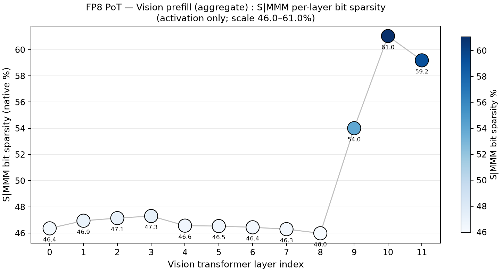
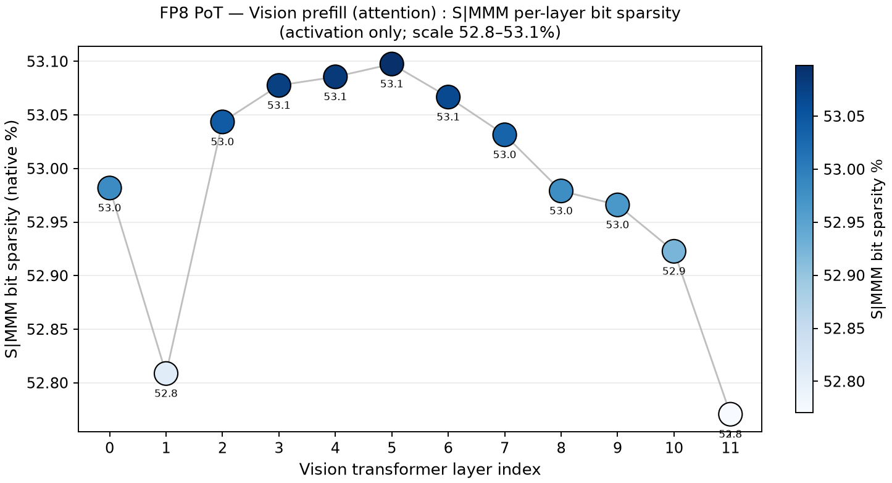
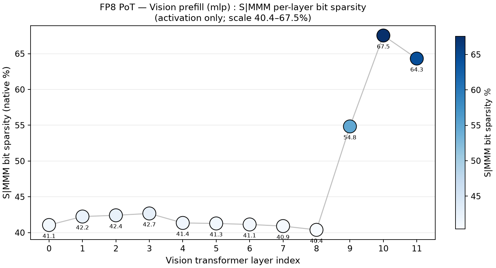

# 结果记录（Results）

- **实验名称**：2026-09-22_phaseI_vision-smmm-sparsity
- **状态**：done（VS1 task0×1ep）
- **最后更新**：2026-09-22

---

## 1. 摘要

VS1 于 2026-09-22 一次跑通，全 5 个 Gate PASS。**在完整 VLIN FP8 workload（360 quantized modules）下，S\|MMM bit-zero 现象贯穿 Vision / VLM / Expert 三条通路**：runtime S\|MMM 落在 **48.6% – 54.1%**，static weight S\|MMM 落在 **53.4% – 55.1%**，pooled 分别为 **51.29% / 54.12%**。这直接回答 er.md 的预设问题：约 50%+ 的 SMMM bit 为零并非只存在于语言/Expert 通路，Vision Encoder 的 72 个 QuantizedLinear 同样成立。

## 2. 总结果表

口径：native（排除 outlier protection 产生的 artificial zero）；FP bit metric = **S\|MMM v1**（E4M3 raw `S EEEE MMM` → 统计 `S MMM`，sign+mantissa 计入，exponent 与 hidden leading 1 不计）；pooled = sum(zero)/sum(total)。

| Component | Runtime element sparsity | Runtime S\|MMM bit sparsity | Weight element sparsity | Weight S\|MMM bit sparsity | 状态 |
|---|---:|---:|---:|---:|---|
| Vision | 4.0751% | **48.6427%** | 0.000556% | **54.4109%** | ✅ |
| VLM | 1.9173% | **53.9747%** | 0.000552% | **53.3657%** | ✅ |
| Expert | 3.0237% | **54.1477%** | 0.000332% | **55.0755%** | ✅ |
| all_quantized pooled | 3.4421% | **51.2876%** | 0.000489% | **54.1198%** | ✅ |

原始分母（bit）：

| Component | runtime zero/total S\|MMM bits | weight zero/total S\|MMM bits |
|---|---|---|
| Vision | 9,822,235,675 / 20,192,624,640 | 184,854,991 / 339,738,624 |
| VLM | 2,370,529,044 / 4,391,923,692 | 335,747,813 / 629,145,600 |
| Expert | 7,877,141,510 / 14,547,511,872 | 216,385,162 / 392,888,320 |
| all_quantized | 20,069,906,229 / 39,132,060,204 | 736,987,966 / 1,361,772,544 |

## 3. 分组结果与分析

### 3.1 Vision / VLM / Expert

- **bit sparsity 三通路高度聚拢**：runtime 48.6/54.0/54.1%，weight 54.4/53.4/55.1%。Vision 的 runtime bit sparsity 比 VLM/Expert 低约 5.3–5.5pp，但其 **static weight bit sparsity 54.41% 与 VLM/Expert（53.4–55.1%）几乎一致**。
- **element sparsity 呈相反次序**：Vision runtime element 4.08% ≈ 2.1× VLM 1.92%，与 VSC 记录一致；但 element 级稀疏（~2–4%）与 bit 级稀疏（~50%）差一个数量级 —— 因为 E4M3 只有 3 个 mantissa bit，绝大多数非零元素总有若干低 mantissa 位为零。
- **weight element sparsity ≈ 0（0.0003–0.0006%）**：element-level 零权重机会极小，S\|MMM bit 才是可用的编码层机会，与 VSC 结论一致。

### 3.2 结构 Gate

| 项 | 期望 | 实测 | 判定 |
|---|---:|---:|:--:|
| Vision runtime rows | 72×2 = 144 | 144 | ✅ |
| Vision weight rows | 72 | 72 | ✅ |
| VLM runtime rows | 112×2+32×3 = 320 | 320 | ✅ |
| VLM weight rows | 112 | 112 | ✅ |
| Expert runtime rows | 320×10 = 3200 | 3200 | ✅ |
| Expert weight rows | 112 | 112 | ✅ |
| all runtime rows | 144+320+3200 = 3664 | 3664 | ✅ |
| static weight total | 296 | 296 | ✅ |
| quantization manifest | 360 | 360 | ✅ |

modules：`Replaced 224 Linear modules` + `Replaced 72 vision/connector Linear modules`（=296 Linear）+ `64 QuantizedMatMul` = **360**，与 manifest 361 行（含 header）一致。

### 3.3 SR（1 episode，不作结论）

task0×1ep = **100%**（success），仅证明该量测运行本身前向与 rollout 正常，**不构成精度结论**。

### 3.4 与历史 1MMM 的关系

历史 VSC 的 1MMM 只能作为旧口径参考。正式比较必须明确 old=1MMM、new=S\|MMM，不能把两者视为同一 bit metric：S\|MMM 把 sign 纳入统计且把「exponent 全零」排除，因此同一 workload 下 S\|MMM 显著高于 1MMM（在 S4 VLM/Expert quickscan 中为 +12.10pp）。本实验 CSV 额外写入 `fp_bit_metric=S|MMM` / `fp_bit_metric_version=1` 以防混用。

### 3.5 逐层分布图（Vision，S\|MMM，activation only）

只统计 **activation** role（各 Vision Linear 的输入张量），按 bits 加权聚合，12 层。绘图口径与 `2026-09-22_quickscan_smmm-bit-sparsity` 完全一致，但 Vision 只有 VLM/Expert 的折线图形式（无 denoise step 维度）。

**聚合（fc1/fc2 + q/k/v/out_proj 的 activation）**

**Attention 分支（q/k/v/out_proj）**

**MLP 分支（fc1/fc2）**

**图内要点（逐层数值）**

| 分组 | L00 | L01–L08 | L09 | L10 | L11 |
|---|---:|---:|---:|---:|---:|
| 聚合 | 46.4% | 46.0–47.3% | **54.0%** | **61.0%** | **59.2%** |
| attention | 53.0% | 52.8–53.1%（完全平坦） | 53.0% | 52.9% | 52.8% |
| mlp | 41.1% | 40.4–42.7% | **54.8%** | **67.5%** | **64.3%** |

- **深层跳升 100% 来自 MLP**：attention 在 12 层是绝对平线（52.8–53.1%），mlp 在 L09–L11 跳到 54.8/67.5/64.3%（前 9 层 ~41%）——新口径下对比度比旧口径更强（mlp 深层 67.5% vs attention 53%，差 14.5pp）。
- **Vision MLP 前 9 层是三条通路中最低的一段**（~41% vs VLM/Expert 的 ~53%）：Vision fc1 activation 数值分布更连续，低位零更少。
- **attention 的 S\|MMM 零率是跨模态不变量**：Vision 52.8–53.1% ≈ VLM 52.4–53.2% ≈ Expert 52.4–53.0%，三通路几乎重合。
- **直接回答 §5 的待查问题**：Vision runtime S\|MMM（48.64%）低于 weight（54.41%）的原因不在 attention，而在 **Vision MLP 前 9 层的低稀疏 activation（~41%）**拉低了均值；attention activation 与 weight 同量级（~53%）。

## 4. 结论

1. **约 50%+ 的 S\|MMM bit-zero 是全 workload 现象**，不是 VLM/Expert 独有：Vision 72 个 QuantizedLinear 的 static weight S\|MMM = 54.41%，runtime = 48.64%，与 VLM/Expert（~54%）同量级。
2. **static weight 的 S\|MMM 三通路几乎重合（53.4–55.1%，极差 1.7pp）** —— 这是最干净的一条证据：不同模态、不同通路、不同层的 FP8 权重在 S\|MMM 编码层上呈现近乎一致的低位零率。
3. pooled all_quantized：runtime **51.29%** / weight **54.12%**，可作为一个统一的「FP8 VLA workload S\|MMM bit-zero」headline 数字。
4. S\|MMM zero-bit ratio 是**编码层 opportunity**，不等价于真实硬件 MAC/energy reduction；本实验不主张任何硬件收益。

## 5. 问题与后续

- ~~Vision runtime S\|MMM（48.64%）比 weight（54.41%）低约 5.8pp，建议按 A/W/O 分项拆 Vision 确认是 A 还是 W 拉低~~ → **已由 §3.5 逐层图回答**：是 Vision MLP（fc1/fc2）前 9 层的 activation（~41%）拉低，attention activation 与 weight 同量级（~53%）。
- 只有 1 episode，适合快速 workload characterization，不用于估计跨 task 方差。若需稳定性验证，在本实验目录内新增 3ep/10ep config 变体，不新建新的顶层实验。
- Vision QK/PV 与 connector 仍为 raw，因此 Vision bit sparsity 只代表 Vision 72 QuantizedLinear，不代表完整 Vision Encoder 所有算子。
- **图仅含 activation**：Vision 的 weight/output 逐层分布未绘图（weight 三通路 53.4–55.1% 见 §2 总表）。

## 6. 修订记录

| 日期 | 修改内容 | 修改人 |
|---|---|---|
| 2026-09-22 | 创建实验；暂时只配置 task0×1ep | |
| 2026-09-22 | VS1 跑通并回填结果（5 Gate PASS，SR=100%） | |
| 2026-09-22 | 新增 §3.5 逐层分布图（聚合 / attention / mlp 三组，activation only，共 3 张）；用图回答原 §5 的 Vision runtime 低于 weight 的待查问题 | |