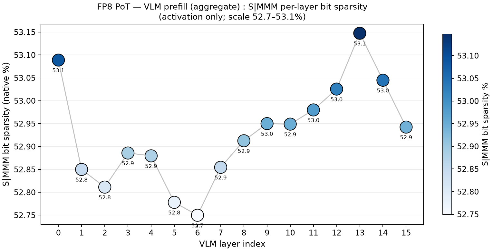
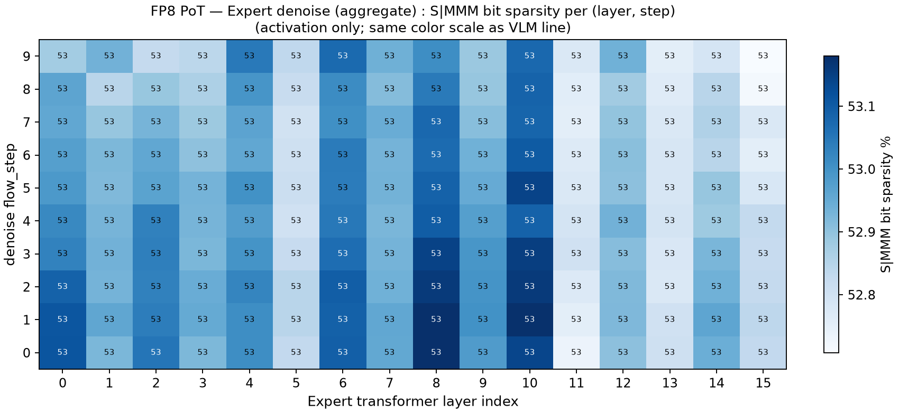
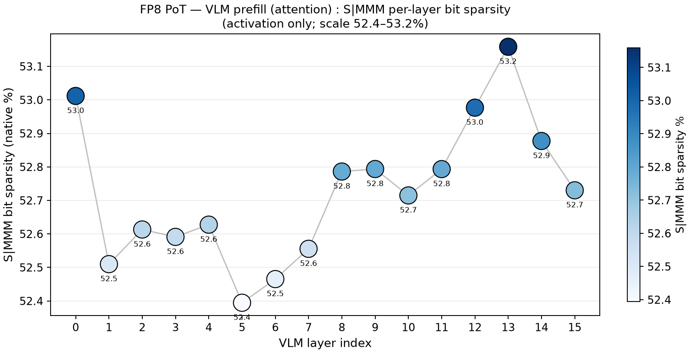
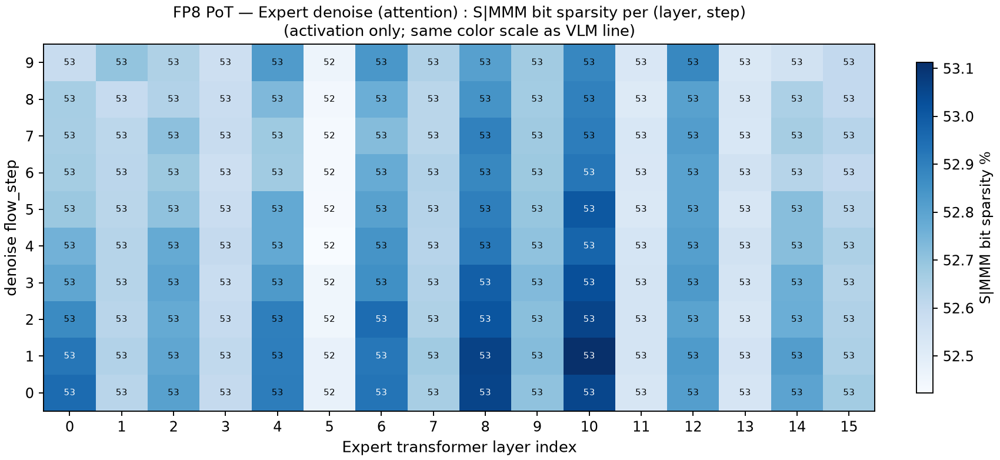
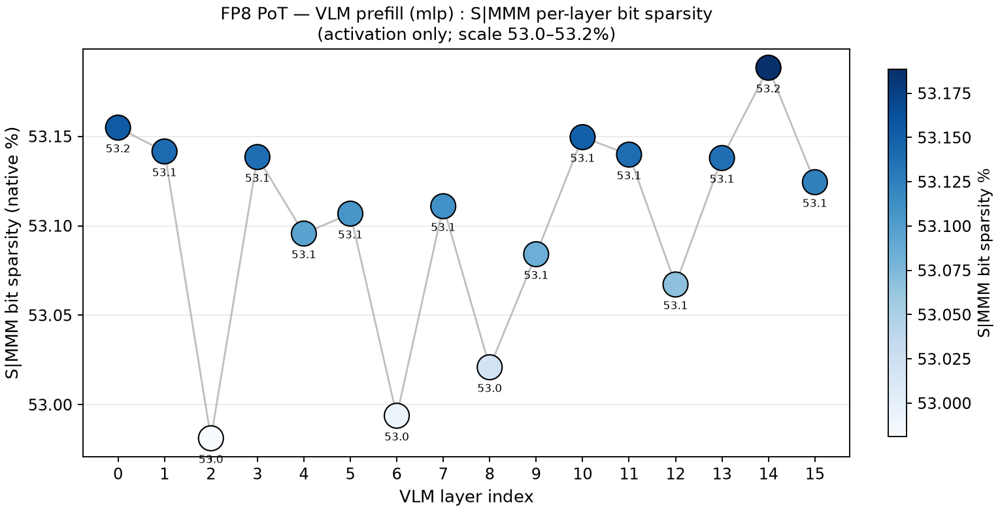
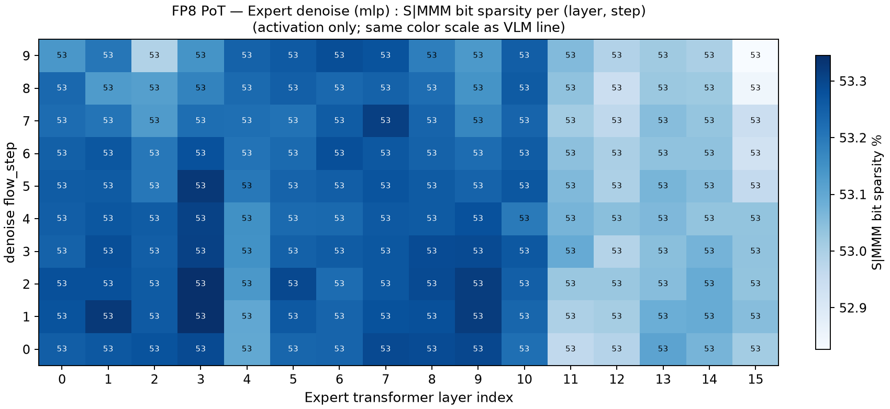

# 结果记录（Results）

> 本文档在实验**过程中与结束后**持续更新。章节为固定结构，不可删除；无内容写「无」。
> 图片放 `docs/figures/`，文中用相对路径 `` 引用。

- **实验名称**：2026-09-22_quickscan_smmm-bit-sparsity
- **状态**：done
- **最后更新**：2026-09-22

---

## 1. 摘要

在 **S|MMM bit 口径**（sign+mantissa，exponent 与 hidden leading 1 均不计，共 4 bit/元素）下重测 FP8 PoT 的稀疏度。与 09-15 quickscan 的旧 1.MMM 口径对照，**runtime bit sparsity 从 42.01% 升到 54.11%（+12.10pp）**，精确验证了审阅预测的 +12.5pp（旧口径的 hidden bit 对 normal 数恒为 1 → 0% sparse；新口径的 sign 位在正负均衡时约 50% 为 0，首位 sparse 率差 50pp，折合 4 bit 宽度为 +12.5pp）。element sparsity 不受口径影响（VLM 1.92% / Expert 3.02%，与 09-15 q3 逐位一致）；weight element sparsity 仍 ≈ 0。

## 2. 总结果表

| 组件 | runtime elem | runtime **S\|MMM** bit | weight elem | weight **S\|MMM** bit | 旧 1.MMM runtime bit | Δ bit |
|---|---:|---:|---:|---:|---:|---:|
| VLM prefill | 1.92% | **53.97%** | 0.00% | 53.37% | 41.69% | **+12.28pp** |
| Expert denoise | 3.02% | **54.15%** | 0.00% | 55.08% | 42.15% | **+12.00pp** |
| pooled | 2.77% | **54.11%** | 0.00% | 54.02% | 42.01% | **+12.10pp** |

数据源：`smmm_sparsity_summary.csv`（由 `scripts/summarize_smmm_sparsity.py` 从 `s4_fp8_smmm/sparsity/{module_sparsity,weight_sparsity_static}.csv` 生成）。

## 3. 分组结果与分析

### 3.1 S|MMM vs 1.MMM 口径差

| 项 | 1.MMM（09-15 q3） | S|MMM（本实验） | Δ | 理论预期 |
|---|---:|---:|---:|---:|
| VLM runtime bit | 41.69% | 53.97% | +12.28pp | +12.5pp |
| Expert runtime bit | 42.15% | 54.15% | +12.00pp | +12.5pp |
| VLM weight bit | 40.86% | 53.37% | +12.51pp | +12.5pp |
| Expert weight bit | 42.58% | 55.08% | +12.50pp | +12.5pp |

分析：实测 Δ 在 +12.00～+12.51pp 之间，与理论值完全吻合（偏差 ≤ 0.5pp）。weight 侧的 Δ（+12.50/+12.51pp）比 runtime 侧（+12.00/+12.28pp）更贴近 12.5pp——因为权重正负更接近完全均衡，而激活存在少量偏置/零值。

### 3.2 不受口径影响的量（对照组）

| 项 | 09-15 q3 | 本实验 | 说明 |
|---|---:|---:|---|
| VLM runtime elem | 1.92% | 1.92% | 逐位一致 |
| Expert runtime elem | 3.02% | 3.02% | 逐位一致 |
| weight elem | ≈0 | 0.00% | 不受影响 |

分析：element sparsity 只取决于量化后是否为精确 0，与 bit 编码口径无关。两者逐位一致证明本次运行除 bit metric 外无其他变化（scale sha256 bit-identical + `--skip-calibration` 生效）。

### 3.3 逐层分布图（S|MMM，activation only）

下图均只统计 **activation** role（各 Linear 的输入张量，排除 output 与 MatMul 的 A/B/O），按 bits 加权聚合；VLM 折线图与对应 Expert 热力图**共用同一色标**，便于直接对照。

**聚合（7 个 Linear 的 activation 全部合并）**

VLM prefill — 逐层 S\|MMM bit sparsity（52.7–53.1%，几乎平线）：

Expert denoise — 层 × denoise step 热力图（列均值 52.8–53.1%，无行/列结构）：

**Attention 分支（q/k/v/o_proj + qk + pv 的 activation）**

**MLP 分支（gate/up/down_proj 的 activation）**

**图内要点**

- **mlp 略高于 attention**：VLM 53.1% vs 52.6%，Expert 53.1% vs 52.7%（约 +0.5pp），这是 S\|MMM 口径下唯一稳定的分支差异。
- **层间/步间结构基本消失**：三组图的层极差 ≤ 0.8pp、step 极差 ≤ 0.3pp——FP8 宽动态范围使各层表现趋同，与 INT8/INT16 的「L00 峰」形成对比。
- 绘图口径与 09-15 quickscan 的 `*_actonly.png` 系列一致，仅 bit metric 不同，可直接并排对比观察 +12pp 的整体抬升。

## 4. 结论

1. **S|MMM 口径下 FP8 PoT 的 bit sparsity ≈ 54%**（VLM 53.97% / Expert 54.15% / pooled 54.11%），比旧 1.MMM 口径高 +12.1pp。
2. 与审阅的定量预测（+12.5pp，42% → ~54.5%）吻合：首位从「hidden 1（恒非零）」换成「sign（~50% 为零）」在 4 bit 宽度上贡献 +12.5pp。
3. **element sparsity 不变**（1.92%/3.02%），确认口径修改只影响 bit 级指标，且与 09-15 协议逐位一致。
4. **结论方向不变**：element-level skipping 空间仍很有限；bit-level sparsity 在 S|MMM 口径下依然在 50%+ 量级，bit-serial/bit-skip 类硬件依然是最值得探索的方向（且比旧口径的数据更乐观）。
5. **口径警告**：本实验数字（~54%）与 09-15 quickscan / VSC 的历史数字（~42%）**不可直接混用**，必须在同一口径下比较。

## 5. 问题与后续

- **图仅含 activation**：weight/output 的逐层分布未单独绘图（weight 的 S\|MMM 层间同样平坦，与 runtime 同量级，见 §2 总表）。
- 若后续换用 INT8/INT16 或 W4 配置，同一绘图脚本可直接复用（只需改数据源），用于观察低 bit 下落层间结构是否重现。

## 6. 修订记录

| 日期 | 修改内容 | 修改人 |
|---|---|---|
| 2026-09-22 | 创建文档 | |
| 2026-09-22 | 回填 S4 结果：S\|MMM pooled runtime bit = **54.11%**（+12.10pp vs 旧 1.MMM 42.01%）；验证审阅的 +12.5pp 预测；Gate 全 PASS | |
| 2026-09-22 | 新增 §3.3 逐层分布图（聚合 / attention / mlp 三组 × VLM 折线 + Expert 热力图，共 6 张，activation only，共享色标） | |
