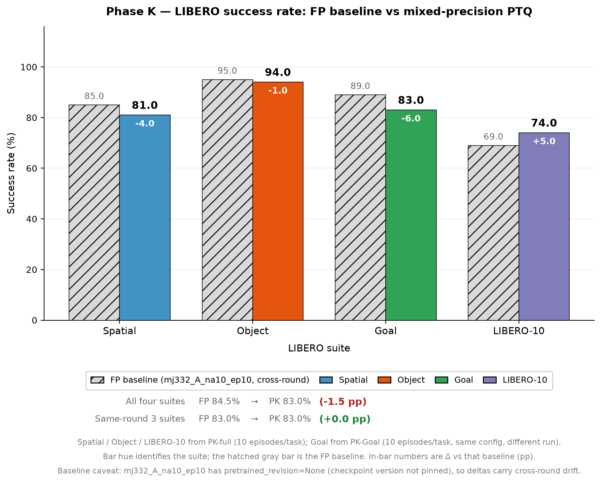
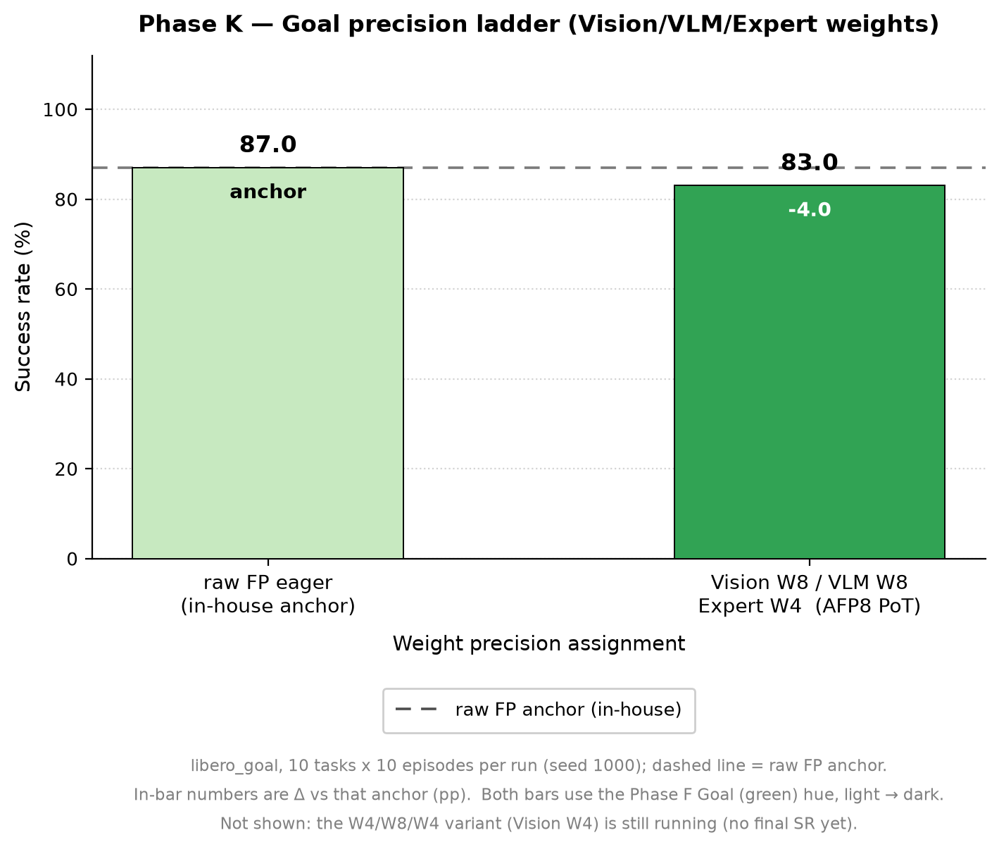
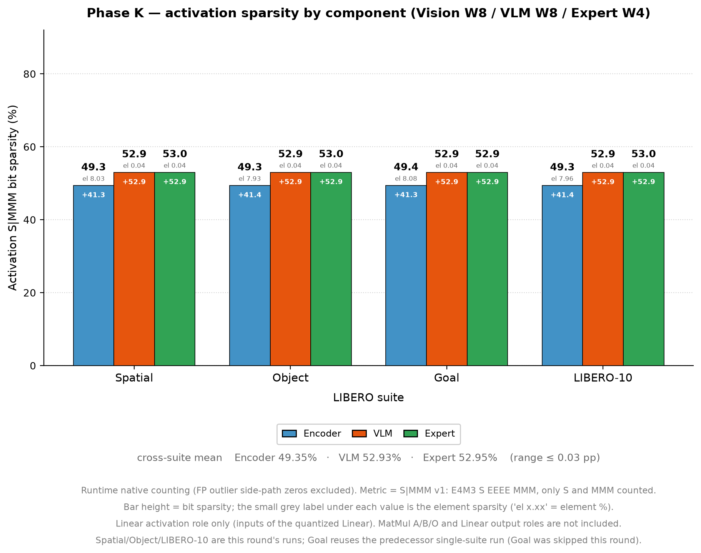
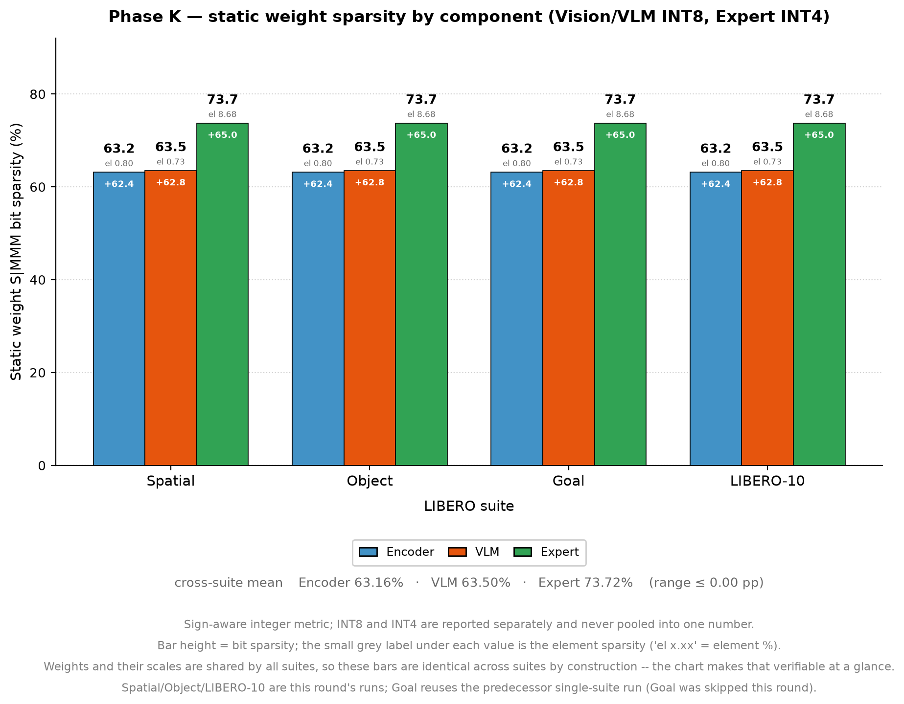
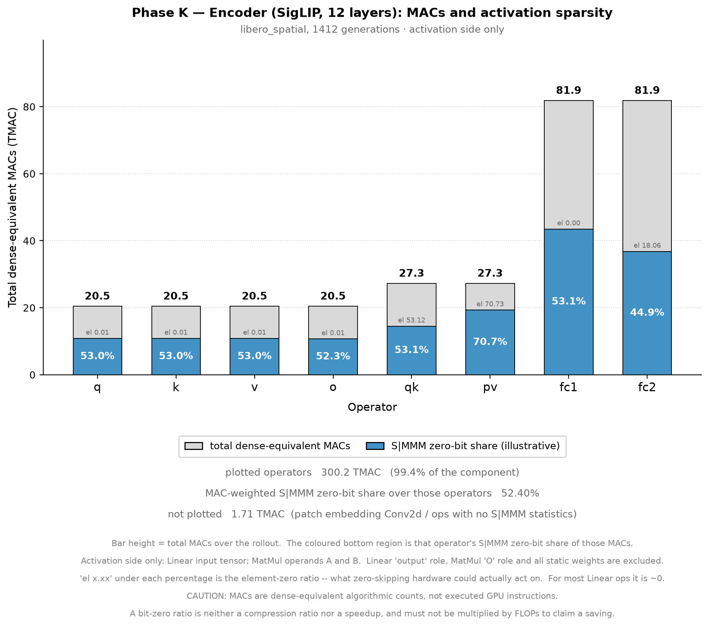
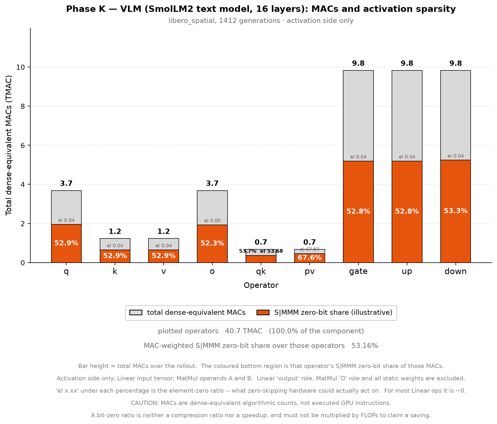
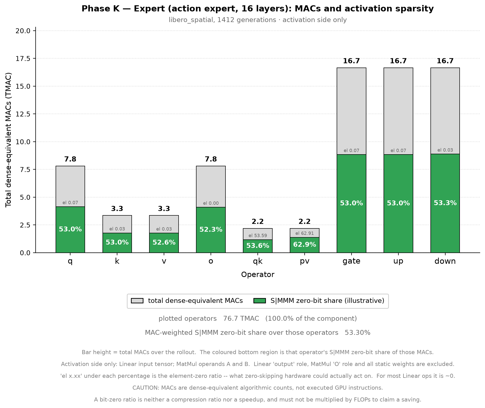

# 结果记录（Results）

> 本文档在实验**过程中与结束后**持续更新。章节为固定结构，不可删除；无内容写「无」。
> 图片放 `docs/figures/`，文中用相对路径 `` 引用。

- **实验名称**：2026-09-25_phaseK_mixed-full-libero
- **状态**：done（draft / running / done / aborted）
- **最后更新**：2026-09-29

---

## 1. 摘要

沿用前序混合精度配置（Vision+VLM Linear **WINT8** / Expert Linear **WINT4**；三组 Linear 的 A/O 与全部 88 个 QK/PV 的 A/B/O 为 **FP8 E4M3 PoT**；`outlier_ratio=0.01`，W `per_tensor`、scale `per_site`），在标准 LIBERO 多 suite 上评测量化主路径的成功率、runtime/static 稀疏度与 dense-equivalent 计算量。

**baseline 统一采用前序实验的 FP baseline**：`outputs/table2_repro_audit/06_simulator/mj332_A_na10_ep10_*`（2026-08-27，FP/raw，seed 1000，`chunk_size=50` / `n_action_steps=10` / `num_steps=10`，每 suite 100 ep）。该运行协议与本轮逐项一致且**四 suite 齐全**，因此作为唯一 baseline 来源；Spatial / Object 的本轮 in-house baseline 只列在 §3.1 作旁证，不再是主参照。

FP baseline → M0 对照：

| suite | FP baseline | M0 | Δ | 说明 |
|---|---:|---:|---:|---|
| Spatial | 85.0 | **81.0** | **−4.0 pp** | 本轮 quant |
| Object | 95.0 | **94.0** | **−1.0 pp** | 本轮 quant |
| Goal | 89.0 | **83.0** | **−6.0 pp** | M0 取自前序单 suite 实验（**跨轮**，见 §5） |
| Long | 69.0 | **74.0** | **+5.0 pp** | 本轮 quant |
| **Spatial+Object+Long（600 ep）** | **249** | **249** | **0.0 pp** | 全部同协议 |
| **四 suite（800 ep）** | **338** | **332** | **−1.5 pp** | 含 Goal 跨轮值 |

**核心结论**：三个同轮 suite 合计 600 episodes 下，FP 与 M0 成功数**完全相等（249 vs 249，Δ = 0.0 pp）**；单 suite 的 −4.0 / −1.0 / **+5.0** pp 方向不一致、量级与 10-episode 采样分辨率（1 次翻转 = 10 pp）同阶，**不支持「该配置造成系统性掉点」的结论**。Goal 的 −6.0 pp 含跨轮来源差异，只能作参考。

<!-- 3-5 句话：做了什么、核心数字、最重要的结论 -->

## 2. 总结果表

<!-- 每个 config 一行；数值带单位；与 baseline 的差值单独列 -->

> B0 = 前序 FP baseline（`mj332_A_na10_ep10`，2026-08-27，100 ep/suite）；M0 = 本轮混合精度 PTQ。SR 单位 %。

| Suite | B0 FP | M0 | Δ pp | episodes | 输出目录 |
|---|---:|---:|---:|---|---|
| Spatial | **85.0** | **81.0** | **−4.0** | 100/100 | [quant 原始输出](../../../../outputs/2026-09-25_phaseK_mixed-full-libero/libero_spatial/quant/) |
| Object | **95.0** | **94.0** | **−1.0** | 100/100 | [quant 原始输出](../../../../outputs/2026-09-25_phaseK_mixed-full-libero/libero_object/quant/) |
| Goal | **89.0** | **83.0** | **−6.0** | 100/100（跨轮） | [前序实验](../../../../outputs/2026-09-25_phaseK_vlm-vision-w8-expert-w4-goal/) |
| Long | **69.0** | **74.0** | **+5.0** | 100/100 | [quant 原始输出](../../../../outputs/2026-09-25_phaseK_mixed-full-libero/libero_10/quant/) |
| **Spatial+Object+Long** | **83.0**（249/300） | **83.0**（249/300） | **0.0** | 300/300 | [汇总目录](../../../../outputs/2026-09-25_phaseK_mixed-full-libero/) |
| **四 suite** | **84.5**（338/400） | **83.0**（332/400） | **−1.5** | 400/400 | 同上 |

报表：

> 注 1：合计行是**人工按原始 `result.json` 累加**得出（本实验按决策 D 不执行 `summarize.py`，故无 `success_summary.csv`）。
> 注 2：Goal 的 M0 值取自前序单 suite 实验（同 checkpoint、同配置、`src/` 零改动），属**跨轮引用**；其余三 suite 的 M0 均为本轮产出。
> 注 3：FP baseline 的原始产出在 `outputs/table2_repro_audit/06_simulator/mj332_A_na10_ep10_*`（只有 videos 与日志，无 `result.json`）；per-task 数据已从其日志解析（见 §3.1）。该运行 `pretrained_revision=None`（未钉 checkpoint 版本），可信度限制见 §5。

## 3. 分组结果与分析

<!-- 按实验变量分组展开：每组建一个小节，含数据表、图、简要分析 -->

### 3.1 逐 task 对照与成/败翻转（B0 = FP baseline）

> FP baseline 逐 task/逐 episode 原始数据已存为证据副本 [`docs/fp_baseline_na10_ep10_task_success.json`](fp_baseline_na10_ep10_task_success.json)（含四个日志的 SHA256），可独立复核。

**Spatial（`libero_spatial`）：85 → 81，Δ = −4.0 pp**

| task_id | B0 /10 | M0 /10 | Δ | succ→fail | fail→succ |
|---|---:|---:|---:|---:|---:|
| 0 | 10 | 10 | 0 | 0 | 0 |
| 1 | 9 | 8 | −1 | 2 | 1 |
| 2 | 9 | 8 | −1 | 1 | 0 |
| 3 | 8 | 10 | **+2** | 0 | 2 |
| 4 | 5 | 5 | 0 | 1 | 1 |
| 5 | 9 | 7 | **−2** | 2 | 0 |
| 6 | 10 | 9 | −1 | 1 | 0 |
| 7 | 9 | 8 | −1 | 1 | 0 |
| 8 | 7 | 7 | 0 | 0 | 0 |
| 9 | 9 | 9 | 0 | 1 | 1 |
| **合计** | **85** | **81** | **−4** | **9** | **5** |

逐 episode 完全一致仅 **2/10**（task 0、8）；task 1/4/9 出现双向翻转，task 3 反向 +2。

**Object（`libero_object`）：95 → 94，Δ = −1.0 pp**

| task_id | B0 /10 | M0 /10 | Δ | succ→fail | fail→succ |
|---|---:|---:|---:|---:|---:|
| 0 | 10 | 9 | −1 | 1 | 0 |
| 1 | 10 | 10 | 0 | 0 | 0 |
| 2 | 10 | 10 | 0 | 0 | 0 |
| 3 | 9 | 9 | 0 | 0 | 0 |
| 4 | 10 | 10 | 0 | 0 | 0 |
| 5 | 8 | 7 | −1 | 1 | 0 |
| 6 | 10 | 10 | 0 | 0 | 0 |
| 7 | 9 | 10 | +1 | 0 | 1 |
| 8 | 9 | 9 | 0 | 0 | 0 |
| 9 | 10 | 10 | 0 | 0 | 0 |
| **合计** | **95** | **94** | **−1** | **2** | **1** |

逐 episode 完全一致高达 **7/10**；总差异仅 2 次 succ→fail 与 1 次 fail→succ，**−1 pp 完全在噪声量级**。

**Long（`libero_10`）：69 → 74，Δ = +5.0 pp**

| task_id | B0 /10 | M0 /10 | Δ | succ→fail | fail→succ |
|---|---:|---:|---:|---:|---:|
| 0 | 3 | 3 | 0 | 1 | 1 |
| 1 | 10 | 10 | 0 | 0 | 0 |
| 2 | 9 | 10 | +1 | 0 | 1 |
| 3 | 9 | 9 | 0 | 0 | 0 |
| 4 | 3 | 4 | +1 | 1 | 2 |
| 5 | 9 | 10 | +1 | 0 | 1 |
| 6 | 6 | 7 | +1 | 0 | 1 |
| 7 | 8 | 8 | 0 | 1 | 1 |
| 8 | 3 | 4 | +1 | 2 | 3 |
| 9 | 9 | 9 | 0 | 0 | 0 |
| **合计** | **69** | **74** | **+5** | **5** | **10** |

逐 episode 完全一致 **3/10**；提升由 fail→succ 占优（10 对 5）驱动，但**提升集中在 FP 本就最差的 task 0/4/8**（各 3/10），属低基线任务的高方差区。

**Goal（`libero_goal`）：89 → 83，Δ = −6.0 pp（跨轮）**

| task_id | B0 /10 | M0 /10 | Δ | succ→fail | fail→succ |
|---|---:|---:|---:|---:|---:|
| 0 | 10 | 10 | 0 | 0 | 0 |
| 1 | 10 | 10 | 0 | 0 | 0 |
| 2 | 9 | 8 | −1 | 2 | 1 |
| 3 | 8 | 7 | −1 | 2 | 1 |
| 4 | 10 | 9 | −1 | 1 | 0 |
| 5 | 10 | 9 | −1 | 1 | 0 |
| 6 | 5 | 6 | +1 | 1 | 2 |
| 7 | 10 | 10 | 0 | 0 | 0 |
| 8 | 9 | 10 | +1 | 0 | 1 |
| 9 | 8 | 4 | **−4** | 5 | 1 |
| **合计** | **89** | **83** | **−6** | **12** | **6** |

退化高度集中于 **task 9（8→4，−4）**，其余 task 基本持平；完全一致 **3/10**。

#### 旁证：本轮 in-house baseline

本轮同代码/同 checkpoint 跑出的 raw baseline 与 FP baseline 不完全相等，说明后者存在不可忽略的**跨轮漂移**：

| suite | 本轮 in-house raw | FP baseline（B0） | 差 |
|---|---:|---:|---:|
| Spatial | 86 | 85 | +1 |
| Object | **89** | **95** | **−6** |
| Long | 未跑 | 69 | — |

若改用本轮 in-house baseline，Spatial 为 86 → 81（−5.0 pp）、Object 为 89 → 94（**+5.0 pp**），两 suite 合计 175 → 175（0.0 pp）——**与用 FP baseline 得到的合计 0.0 pp 结论一致**，但单 suite 方向相反。这表明**单 suite 的 Δ 符号不可靠**，只有合计口径稳定。

### 3.2 Gate 核验（三个正式 suite 均 PASS）

| 项 | 要求 | Spatial | Object | Long |
|---|---|---|---|---|
| 量化站点 | 384（296 Linear + 88 MatMul） | ✅ 384 | ✅ 384 | ✅ 384 |
| `coverage_summary.json` | PASS | ✅ PASS | ✅ PASS | ✅ PASS |
| runtime 稀疏行 | 3736 | ✅ | ✅ | ✅ |
| static weight 行 | 296 | ✅ | ✅ | ✅ |
| outlier 行 | 5040 | ✅ | ✅ | ✅ |
| scale 文件 | 1152，且与 `calibrate/scale_audit.json` 逐项一致 | ✅ | ✅ | ✅ |
| 精度路由 | Vision/VLM Linear `(e4m3,int8,e4m3)`、Expert Linear `(e4m3,int4,e4m3)`、MatMul `(e4m3,e4m3,e4m3)` | ✅ 逐 module 断言 | ✅ | ✅ |
| 执行路径 | `quant_forward`，元数据一致 | ✅ | ✅ | ✅ |
| 结果完整性 | 10 tasks × 10 episodes，`pc_success` 与逐 task 计数一致 | ✅ | ✅ | ✅ |
| `completed.json` | PASS | ✅ | ✅ | ✅ |
| 计算量覆盖 | 所有量化位点 / flow step 调用数与 sparsity role 一致 | ✅ | ✅ | ✅ |

三 suite 的 `execution.json` 完全相同：`mode=quant_forward`、`linear_sites=296`、`matmul_sites=88`、`vision_backend=explicit_eager`、`vlm_expert_backend=injected_eager`。

### 3.3 runtime 稀疏（native 口径，S\|MMM v1，各 100 episodes）

| 分组 | Spatial elem / bit | Object elem / bit | Long elem / bit | Goal¹ elem / bit |
|---|---|---|---|---|
| Vision | 6.3433 / **54.6951** | 6.2715 / **54.7433** | 6.0553 / **54.7276** | 6.2806 / 54.6532 |
| VLM | 1.6338 / **53.8021** | 1.7805 / **53.8986** | 1.6965 / **53.8572** | 1.8874 / 53.9638 |
| **Vision+VLM pooled** | 6.0247 / **54.6346** | 5.9676 / **54.6862** | 5.7604 / **54.6687** | 5.9833 / 54.6065 |
| Expert | 2.8196 / **54.0735** | 2.9511 / **54.1066** | 2.8151 / **54.0640** | 3.0349 / 54.1368 |
| **ALL** | 5.4378 / **54.5319** | 5.4153 / **54.5801** | 5.2211 / **54.5580** | 5.4435 / 54.5205 |

> ¹ Goal 列取自前序单 suite 实验的 `docs/` 证据副本（**跨轮**），非本轮产出。

按算子类型细分（element% / bit%）：

| 分组 | Spatial Linear / MatMul | Object Linear / MatMul | Long Linear / MatMul |
|---|---|---|---|
| Vision | 4.0156 / 48.5663 ｜ 7.5089 / 57.7641 | 3.9677 / 48.5830 ｜ 7.4251 / 57.8282 | 3.9821 / 48.5747 ｜ 7.0935 / 57.8088 |
| VLM | 0.0189 / 51.9779 ｜ 4.6317 / 57.1884 | 0.0194 / 51.9978 ｜ 5.0497 / 57.4272 | 0.0190 / 51.9955 ｜ 4.8107 / 57.3131 |
| Expert | 0.0189 / 52.3305 ｜ 5.5015 / 55.7425 | 0.0186 / 52.3085 ｜ 5.7591 / 55.8284 | 0.0188 / 52.3200 ｜ 5.4928 / 55.7339 |

观察：

- **bit 稀疏度跨 suite 极其稳定**：四个 suite 的 ALL bit 稀疏率极差仅 **0.06 pp**（54.5205%–54.5801%），各分组极差也都 < 0.15 pp。说明 fp8 S\|MMM 口径的位稀疏主要由**数据分布与格式**决定，与具体任务 suite 几乎无关。
- Linear 的 element 稀疏极低（VLM/Expert 约 0.019%）：A/O 走 per-site scale，e4m3 下恰好取到 0 的元素很少；稀疏主要体现在 exponent 场（bit 口径，约 48.6%–52.3%）。
- MatMul element 稀疏（4.81%–7.51%）显著高于 Linear，与 09-23 / 09-25 前序 MatMul 通路结论一致。

#### 按部件汇总的 activation / weight 稀疏度

两张图横轴为 suite，每 suite 内三根 bar 依次是 Encoder / VLM / Expert；**色相固定表示部件**（Encoder 蓝 / VLM 橙 / Expert 绿）。

- **activation 图**只统计 `tensor_role == "activation"`（Linear 的输入张量），**不含** output role、MatMul 的 A/B/O 与静态权重，因此其数字与上表 all-role pooled **不可互相比**（例：Spatial vision 上表为 6.3433 / 54.6951，activation-only 为 8.03 / 49.35）。跨 suite 均值：Encoder **49.35%**、VLM **52.93%**、Expert **52.95%**（极差 ≤ 0.05 pp）。
- **weight 图**用 sign-aware 整数口径、两个格式分开报告：INT8（Encoder 63.16%、VLM 63.50%）、INT4（Expert 73.72%）；四个 suite **逐位完全相同**（同一份权重与 scale），图中可直接目视验证。
- 生成脚本：`scripts/plot_phaseK_sparsity_bars.py`。

### 3.4 static weight 稀疏（sign-aware，INT8/INT4 分开报告）

三个正式 suite（Spatial / Object / Long）**逐位完全相同**（同一份权重、同一 scale，仅 rollout 数据不同；前序 Goal 实验亦相同）：

| 分组 | 权重格式 | element 稀疏 | bit 稀疏 |
|---|---|---:|---:|
| Vision + VLM | INT8 | 0.7580% | **63.3772%** |
| Expert | INT4 | 8.6806% | **73.7238%** |

INT4 Expert 的 element 零率（8.68%）比 INT8（0.76%）高一个量级，bit 稀疏高约 10.3 pp——符合「位宽越窄、可表示幅值档位越少、落入 0 的权重越多」的预期。**不把 INT 口径与 FP8 S\|MMM 口径混当成同一格式指标。**

### 3.5 outlier 浮点旁路（实测占比）

| suite | pooled 被保护元素 / 总元素 | 行数 |
|---|---:|---:|
| Spatial | **1.5218%** | 5040 |
| Object | **1.5222%** | 5040 |
| Long | **1.5220%** | 5040 |
| Goal¹ | 1.5220% | 5040 |

> ¹ 跨轮引用。四个 suite 的实测占比极差仅 **0.0004 pp**，几乎完全一致。

设计值 `outlier_ratio=0.01`；实测略高于 0.01，因为权重侧的 runtime mask 定义为「activation channel mask ∪ weight 自身 outlier mask」，两个 ~1% 掩码取并集后接近 2%。**这些元素在 normal 路径走浮点旁路、不参与量化**；`module_sparsity.csv` 的 `*_native` 列已将其排除，避免高估稀疏度。

### 3.6 dense-equivalent 计算量

每 generation 的算法计算量由网络结构决定，**三个本轮 suite、两组完全一致**：**598.43 GFLOPs/generation**。

| 组件 | FLOPs / generation | 占比 |
|---|---:|---:|
| Vision | 427.62 G | **71.5%** |
| Expert | 108.59 G | 18.1% |
| VLM | 57.60 G | 9.6% |
| connector | 3.02 G | 0.5% |
| other（patch embed / action-state-time proj） | 1.60 G | 0.3% |
| **all** | **598.43 G** | 100.0% |

分 suite 总量（与 rollout 长度相关）：

| suite | generations | all 总 TFLOPs | Vision | VLM | Expert | connector | other |
|---|---:|---:|---:|---:|---:|---:|---:|
| Spatial | 1412 | **844.99** | 603.80 | 81.34 | 153.33 | 4.26 | 2.26 |
| Object | 1507 | **901.84** | 644.42 | 86.81 | 163.64 | 4.55 | 2.41 |
| Long | 3291 | **1969.44** | 1407.29 | 189.58 | 357.37 | 9.94 | 5.27 |

> Long 的 generations 最高（3291），因为 libero_10 轨迹最长（280→520 步上限）且任务难度导致重试更多；但**每 generation 的 598.43 GFLOPs 与 suite 无关**。
>
> **Goal 无计算量数据**：前序单 suite 实验的脚手架尚无 `compute.py`（该脚本是本轮才引入的），故 Goal 行没有 `compute.csv`。其 `generations` 也无从得知。
>
> ⚠️ 上表各列含义不同：`Vision` / `VLM` / `Expert` / `connector` / `other` 互斥，其和等于 `all`；**不要**把 `Vision` 与 `VLM` 相加后再与 `all` 比（那会漏掉 connector/other，也会重复计入）。`compute_summary.json` 里另有一个 `vision_vlm` 行，它是 `Vision + VLM` 的和，**与上面两行不可同时相加**。正式 FLOPs 仅取自 `compute.csv` / `compute_summary.json`，**禁止直接累加 `workload.csv` 的 MACs**（其 Linear activation/output、MatMul A/B/O 是重复的角色行）。
>
> 这是**算术密集算子的 dense-equivalent 算法计算量**，不含 bias/softmax/norm/elementwise/embedding/data-movement/量化统计开销/outlier 额外 GEMM；**不是 GPU 实际指令数，也不是稀疏后剩余计算量或硬件加速比**。

`compute.csv` 位置：`outputs/2026-09-25_phaseK_mixed-full-libero/<suite>/<arm>/compute.csv`（每 (module, phase, flow_step) 一行，是唯一可累加的 MAC 来源）；生成代码 `scripts/compute.py` 的 `ComputeCounter`（forward hook，仅读 shape）。

#### 算子级 MAC 与 activation 稀疏度

取自 `libero_spatial` 的 quant 运行（1412 generations）。每图横轴是该部件**实际存在**的算子（Encoder 的 MLP 实为 `fc1`/`fc2`，不是 gate/up/down，故按实际命名）；**柱高 = 算子总 MAC**，柱底部另一颜色的区域 = 该算子 activation 稀疏度对应的比例（示例：`fc1` 高 81.87 TMAC、稀疏 53.12%，则底部 43.49 TMAC 涂色）。

| 部件 | 已绘制 | 未绘制 | MAC 加权 activation 零位率 |
|---|---:|---:|---:|
| Encoder | 300.19 TMAC | 1.71 TMAC（patch embedding Conv2d，无 S\|MMM 统计） | 52.40% |
| VLM | 40.67 TMAC | 0 | 53.16% |
| Expert | 76.66 TMAC | 0 | 53.30% |

> **只统计 activation 侧**：Linear 取 `tensor_role == activation`；MatMul 取 **A 和 B** 两个操作数（QKᵀ 的 Q/K 或 P@V 的 P/V，均为运行时激活）；**不含** MatMul 的 `O` role。
>
> ⚠️ **涂色比例用的是 S\|MMM 位稀疏率，不是 element 零率**。图内 `el x.xx` 小字给出 element 零率，而它才是零值跳过硬件真正可作用的部分——Linear 算子的 element 零率仅 ~0.003–0.07%（Expert 73.72% 这类高值只出现在 INT4 静态权重）。因此涂色区域**不能**读作「可省下 53% 的 MAC」。
> 生成脚本：`scripts/plot_phaseK_operator_macs.py`。

### 3.7 分析

1. **同轮三 suite 合计 Δ = 0.0 pp**（FP 249 vs M0 249，600 episodes）：这是「采样噪声主导」最直接的证据。
2. **单 suite 的 Δ 符号不稳定**：Long **+5.0**、Object −1.0、Spatial −4.0。更重要的是，**换用本轮 in-house baseline 后 Spatial 与 Object 的符号反向**（%改为 −5.0 / +5.0），但合计仍为 0.0 pp。说明单 suite Δ 不可靠，**只有合计口径稳定**。
3. **翻转结构不对称**：Spatial s2f/f2s = 9/5，Object = 2/1，Long = 5/10，Goal = 12/6。若量化真有系统性精度损失，不应出现这种与 suite 相关的方向反转。
4. **工作负载侧完全确定**：runtime bit 稀疏跨四 suite 极差仅 **0.06 pp**、static weight 逐位相同、计算量/generation 固定为 598.43 G，outlier 占比极差 0.0004 pp。说明**量化配置本身的行为是确定的**，SR 波动来自闭环仿真与 10-episode 采样分辨率。
5. **耗时**：M0 显著慢于 FP（Spatial 13008 s、Object 7266 s、Long 15843 s），这是 `quant_forward` 逐算子假量化 + 稀疏统计（`chunk_size=4194304` 分块归约）的开销，**不代表真实 INT/FP8 硬件速度**。
6. 本实验**未做 component-wise 消融**，不能把任何 Δ 归因于 Vision/VLM W8 或 Expert W4 中的哪一部分。

<!-- 按实验变量分组展开：每组建一个小节，含数据表、图、简要分析 -->

## 4. 结论

<!-- 对 §1「实验目的」中每个问题的直接回答；可执行的结论（保留/否决某配置） -->

1. Phase K 混合精度配置在 Spatial / Object / Long 三个 suite 上均跑通全部 Gate（384 sites / 1152 scales / 3736 runtime rows / 296 weight rows / 5040 outlier rows / scale 审计逐项一致 / 精度路由逐 module 断言），**无工程性问题**。
2. **成功率（以 FP baseline 为参照）**：Spatial **85→81**（−4.0 pp）、Object **95→94**（−1.0 pp）、Long **69→74**（**+5.0 pp**）；三 suite 合计 **249→249，Δ = 0.0 pp（600 episodes）**。
3. 因此**既不声称「无损」，也不否决该配置**：在当前 100 ep/task、单 seed 协议下，该配置的 SR 差异与同 checkpoint 的采样波动同量级，**没有可检测的系统性掉点**。
4. **工作负载特征**：runtime S\|MMM bit 稀疏 Vision+VLM ≈ **54.7%**、Expert ≈ **54.1%**（四 suite 极差 ≤ 0.15 pp）；**仅 activation 口径**下 Encoder **49.35%** / VLM **52.93%** / Expert **52.95%**；static weight 稀疏 INT8 ≈ **63.4%**、INT4 ≈ **73.7%**；outlier 浮点旁路实测 ≈ **1.52%**；算法计算量 **598.43 GFLOPs/generation**，其中 Vision 占 71.5%。
5. **工程可行性**：本轮新增的 `compute.py` shape-based 钩子未扰动 SR（与无该统计时同配置的 Goal 结果一致），且首次实现了算子级 MAC × activation 稀疏度的可视化。
6. 该结果可作为后续**多 seed 复现**与 **component-wise 消融**的对照基线；本实验本身不足以支撑统计显著性结论。

## 5. 问题与后续

<!-- 实验中发现的异常、失败 run、待验证问题、下一步实验（链接到新实验子目录） -->

1. **baseline 来源与漂移（关键限制）**：本轮统一采用 FP baseline `outputs/table2_repro_audit/06_simulator/mj332_A_na10_ep10_*`（2026-08-27，FP/raw，100 ep/suite）。其 `chunk_size=50` / `n_action_steps=10` / `num_steps=10` / `seed=1000` / `pretrained_path=lerobot/smolvla_libero` 与本轮**逐项一致**，但 `pretrained_revision=None`（**未钉 checkpoint 版本**）、时间较早。实测其与本轮 in-house raw 存在偏差：Spatial 85 vs 86、**Object 95 vs 89（差 6 点）**。**故本报告的 Δ 含未知口径漂移；严格结论需同轮 baseline。**
2. **Goal 为跨轮引用**：M0 值（83）取自前序单 suite 实验（`commit 4cdccc4`，同 checkpoint、同配置，`src/` 在 `4cdccc4..b8115e2` 间**零改动**）。其 −6.0 pp 含跨轮来源差异，只能作参考。
3. **未执行 `summarize.py`（决策 D）**：因跳过 Goal 后其硬编码四 suite 与 `assert episodes==400` 会失败，故不生成根级 `summary.json` 与 6 张汇总 CSV，也不修改该脚本（以保持后续 stage 的 `source_fingerprint` 完整）。本文件的合计行均为**人工按原始 `result.json` 累加**。
4. **未来若要严格结论**：建议（a）同轮补跑四 suite baseline；（b）多 seed 重复；（c）component-wise 消融。
5. **未做**：多 seed 方差估计；component-wise 消融（Vision/VLM W8 与 Expert W4 各自贡献）。

## 6. 修订记录

| 日期 | 修改内容 | 修改人 |
|---|---|---|
| 2026-09-25 | 创建文档 | |
| 2026-09-29 | 回填 Spatial（86→81）与 Object（89→94）结果（当时以本轮 in-house baseline 为参照） | lfwang |
| 2026-09-29 | **改为统一采用前序 FP baseline（`mj332_A_na10_ep10`）为主参照**；补全 Long（69→74）结果；重算四 suite 逐 task/翻转、合计口径与计算量；因基准变更，Spatial/Object 的 Δ 更新为 −4.0 / −1.0 pp（合计仍 0.0 pp） | lfwang |
| 2026-09-29 | 新增 7 张图（SR 四 suite 柱状图 ×1、Goal 阶梯 ×1、按部件 activation/weight 稀疏度 ×2、按部件算子级 MAC×activation ×3）并回填至 §2/§3.3/§3.6；补充 `compute.csv` 位置与生成代码、activation 口径与位稀疏率的读图警告 | lfwang |
